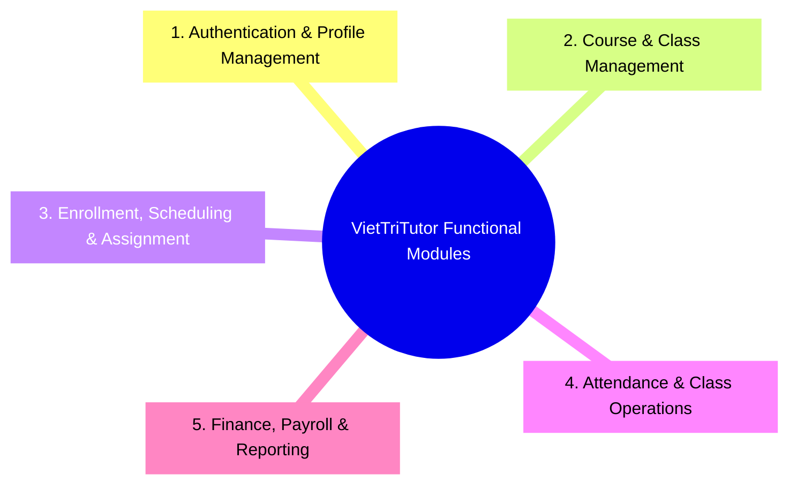

# Functional Requirements (Yêu cầu Chức năng Hệ thống)

Tài liệu này hệ thống hóa toàn bộ các **Yêu cầu Chức năng (Functional Requirements - FR)** của dự án **VietTriTutor**. Mỗi chức năng được đánh mã chuẩn (`FR-XXX`), mô tả chi tiết actor thực hiện, điều kiện tiên quyết (Pre-conditions), luồng thực thi (Flow), và quy tắc nghiệp vụ liên quan (Business Rules).

---

## 1. Phân nhóm Chức năng (Functional Modules Overview)

Hệ thống được chia làm 5 phân hệ (Modules) chính:

---

## 2. Chi tiết Yêu cầu Chức năng (Detailed Functional Requirements)

### 2.1. Phân hệ 1: Authentication & Profile Management (Xác thực & Hồ sơ)

#### `FR-AUTH-01`: Đăng ký & Đăng nhập Hệ thống
- **Actor**: Học viên / Phụ huynh (`ROLE_STUDENT`), Gia sư Trung tâm (`ROLE_TUTOR`), Admin (`ROLE_ADMIN`).
- **Mô tả**: Cho phép người dùng đăng nhập bằng Email/SĐT và Mật khẩu. Hỗ trợ Đăng ký tài khoản dành cho Học viên.
- **Quy tắc**:
  - `ROLE_TUTOR` và `ROLE_ADMIN` do Trung tâm tạo tài khoản trực tiếp, không cho phép đăng ký tự do từ bên ngoài (BR-01.01).
  - Phụ huynh và Học viên dùng chung `ROLE_STUDENT` (BR-01.04).

#### `FR-AUTH-02`: Quản lý Hồ sơ Cá nhân (Profile Management)
- **Actor**: `ROLE_STUDENT`, `ROLE_TUTOR`.
- **Mô tả**: 
  - Học viên xem/sửa thông tin liên hệ, danh sách con em (nếu là phụ huynh).
  - Gia sư xem thông tin cá nhân, môn học đảm nhận, lịch rảnh cá nhân (Availability Slot).

#### `FR-AUTH-03`: Quản lý Danh sách Gia sư Trung tâm
- **Actor**: `ROLE_ADMIN`.
- **Mô tả**: Admin khởi tạo tài khoản gia sư, xem hợp đồng, cấu hình đơn giá dạy/buổi của gia sư (`hourlyRate`), và kích hoạt/khóa tài khoản gia sư.

---

### 2.2. Phân hệ 2: Course & Class Management (Quản lý Khóa học & Lớp học)

#### `FR-CRS-01`: Quản lý Danh mục Khóa học (Course Catalog)
- **Actor**: `ROLE_ADMIN`.
- **Mô tả**: Admin tạo mới, chỉnh sửa, hoặc ẩn các Khóa học.
- **Thông tin thuộc tính Khóa học**: Mã khóa, Tên khóa học, Cấp học (Cấp 1/2/3), Môn học, Học phí gốc 1-1 ($P_{\text{1on1}}$), Hình thức (Online/Offline), Số buổi học.

#### `FR-CRS-02`: Tạo mới Lớp học (Class Creation)
- **Actor**: `ROLE_ADMIN`.
- **Mô tả**: Admin tạo các đợt mở Lớp cho một Khóa học cụ thể.
- **Quy tắc**:
  - Chọn Loại lớp: `ONE_ON_ONE` (Sĩ số 1-1) hoặc `GROUP` (Sĩ số 2 - 8) (BR-02.10).
  - Chọn Mẫu lịch tuần: `MON_WED_FRI` (Thứ 2-4-6), `TUE_THU_SAT` (Thứ 3-5-7), hoặc `SAT_SUN` (Cuối tuần) (BR-03.01).
  - Chọn Khung giờ ca học: `SLOT_MORNING` (08:00-10:00), `SLOT_AFTERNOON` (14:00-16:00), `SLOT_EVENING_1` (18:00-20:00), hoặc `SLOT_EVENING_2` (19:30-21:30) (BR-03.02).
  - Chọn Ngày khai giảng dự kiến và Mốc hạn chốt đăng ký (mặc định 3 ngày trước khai giảng) (BR-02.20).
  - Khi tạo Lớp, hệ thống tự động sinh ra danh sách các Buổi học (`Session`) tương ứng (BR-03.03).

#### `FR-CRS-03`: Công bố & Quản lý Trạng thái Lớp học
- **Actor**: `ROLE_ADMIN`.
- **Mô tả**: Chuyển trạng thái lớp qua các bước trong vòng đời (`DRAFT` $\rightarrow$ `PUBLISHED` $\rightarrow$ `ENROLLING` $\rightarrow$ `ASSIGNED` $\rightarrow$ `IN_PROGRESS` $\rightarrow$ `COMPLETED` / `CANCELLED` / `FAILED_TO_OPEN`) (BR-04.01).

---

### 2.3. Phân hệ 3: Enrollment, Scheduling & Assignment (Đăng ký, Thu tiền & Phân công Dạy)

#### `FR-SCH-01`: Tra cứu & Xem Danh sách Lớp mở Đăng ký
- **Actor**: `ROLE_STUDENT`.
- **Mô tả**: Học viên tìm kiếm, lọc các Lớp học đang ở trạng thái `PUBLISHED` hoặc `ENROLLING` theo môn học, cấp học, mẫu lịch và khung giờ.

#### `FR-SCH-02`: Đăng ký Lớp học & Thanh toán (Enrollment & Payment)
- **Actor**: `ROLE_STUDENT`.
- **Pre-conditions**: Lớp còn chỗ trống và Học viên không bị trùng lịch với bất kỳ Lớp nào đã đăng ký trước đó.
- **Quy tắc**:
  - Hệ thống kiểm tra Validation chặn trùng lịch đối với Học viên (BR-03.31).
  - Tính toán chính xác Học phí theo bảng chiết khấu sĩ số nhóm tại thời điểm đăng ký (BR-02.11).
  - Yêu cầu Học viên thanh toán 100% qua Cổng thanh toán (VNPAY/MOMO/Ngân hàng) (BR-02.02).
  - Thanh toán thành công $\rightarrow$ Ghi nhận `Enrollment` và khóa chỗ. Nếu lớp đầy sĩ số (`FULL`) $\rightarrow$ Khóa không nhận đăng ký mới.

#### `FR-SCH-03`: Phân công Gia sư vào Lớp (Tutor Assignment)
- **Actor**: `ROLE_ADMIN`.
- **Pre-conditions**:
  - Lớp `ONE_ON_ONE`: Đã có 1 enrollment thành công.
  - Lớp `GROUP`: Đã đến hạn chốt đăng ký và sĩ số $\ge 2$ học viên (BR-02.20, BR-03.20).
- **Quy tắc Hard Conflict**:
  - Khi Admin chọn một Gia sư để phân công, hệ thống tự động quét toàn bộ danh sách `Session` của lớp với các `Session` của Gia sư đó.
  - **Nếu trùng $\ge 1$ phút**: Hệ thống CHẶN không cho gán và hiển thị thông báo lỗi chi tiết (BR-03.30).
  - Nếu thành công $\rightarrow$ Lưu `Assignment`, chuyển trạng thái Lớp sang `ASSIGNED`, tự động đẩy lịch dạy lên Calendar của Gia sư và Học viên.

#### `FR-SCH-04`: Xử lý Lớp Nhóm Không Đủ Sĩ Số (`FAILED_TO_OPEN`)
- **Actor**: `ROLE_ADMIN`.
- **Mô tả**: Tại hạn chốt đăng ký, nếu lớp nhóm chỉ có 1 học viên, hệ thống đánh dấu `FAILED_TO_OPEN`. Admin thực hiện 1 trong 3 quyền:
  1. Dời ngày khai giảng (mở lại `ENROLLING`).
  2. Hoàn tiền 100% cho học viên (BR-02.30).
  3. Thỏa thuận chuyển sang Lớp 1-1.

---

### 2.4. Phân hệ 4: Attendance & Class Operations (Vận hành Buổi học, Xin nghỉ & Điểm danh)

#### `FR-OPS-01`: Xin Nghỉ & Đề nghị Dời Buổi học (Reschedule Request)
- **Actor**: `ROLE_STUDENT`, `ROLE_TUTOR`.
- **Quy tắc**:
  - Báo trước $\ge 24$ giờ: Buổi học đổi trạng thái `PENDING_RESCHEDULE` (BR-03.40).
  - Báo trước $< 24$ giờ: Đánh dấu `ABSENCE_LATE` (Gia sư báo nghỉ muộn/Học viên nghỉ muộn).

#### `FR-OPS-02`: Xử lý Dời Buổi, Xếp Buổi Bù & Phân công Dạy Thay
- **Actor**: `ROLE_ADMIN`.
- **Quy tắc**:
  - Nếu Gia sư xin nghỉ trước $\ge 24$h: Admin chọn (1) Tạo buổi bù `MAKEUP` (qua hệ thống kiểm tra trùng lịch cả gia sư và tất cả học viên) hoặc (2) Phân công Gia sư khác dạy thay (BR-03.40, BR-03.41).
  - Chỉ Admin mới có quyền tạo buổi bù hoặc gán gia sư dạy thay (BR-03.42).

#### `FR-OPS-03`: Điểm danh & Chốt Buổi học (Attendance Check-in)
- **Actor**: `ROLE_TUTOR`, `ROLE_ADMIN`.
- **Quy tắc**:
  - **Lớp Offline**: Gia sư thực hiện Check-in điểm danh từng học viên (`PRESENT`, `ABSENT`, `LATE`, `EXCUSED`) trên giao diện trong/sau ca học (BR-04.20).
  - **Lớp Online (MVP)**: Điểm danh do Gia sư nhập tay theo thông tin trong phòng Zoom/Google Meet/Meeting URL do Admin cung cấp (BR-04.40).
  - Sau 24 giờ kể từ khi kết thúc ca học, hệ thống tự động khóa/chốt điểm danh. Buổi học chuyển sang trạng thái `COMPLETED` (BR-04.33, BR-04.34).

---

### 2.5. Phân hệ 5: Finance, Payroll & Reporting (Tài chính, Bảng lương & Báo cáo)

#### `FR-FIN-01`: Quản lý Giao dịch Học phí & Hoàn tiền
- **Actor**: `ROLE_ADMIN`.
- **Mô tả**: Xem danh sách giao dịch thu học phí từ Học viên. Thực hiện thao tác Hoàn tiền 100% (`Refund`) cho các trường hợp hủy lớp hợp lệ (BR-02.30, BR-02.31).

#### `FR-FIN-02`: Tính toán & Bảng lương Gia sư Hàng tháng (Tutor Payroll)
- **Actor**: `ROLE_ADMIN`, `ROLE_TUTOR`.
- **Mô tả**:
  - Vào cuối tháng dương lịch, hệ thống tự động tính toán tổng lương tháng cho từng Gia sư theo công thức: $\text{Lương Tháng} = \text{Lương Cứng} + (\text{Số Buổi Dạy hợp lệ} \times \text{Đơn Giá Buổi})$ (BR-02.40).
  - **Số buổi dạy hợp lệ**: Chỉ tính các buổi `COMPLETED` mà gia sư đó trực tiếp dạy (bao gồm cả các buổi dạy thay) (BR-02.42, BR-02.44).
  - Admin duyệt và chốt bảng lương (`PAYROLL_LOCKED`). Gia sư đăng nhập chỉ xem được bảng lương cá nhân của mình (BR-01.11, BR-02.46).

---

## 3. Ma trận Yêu cầu Chức năng theo Actor (Actor-Function Matrix)

| Mã Chức năng | Tên Chức năng | Student | Tutor | Admin |
| :--- | :--- | :---: | :---: | :---: |
| `FR-AUTH-01` | Đăng ký & Đăng nhập | **X** | **X** | **X** |
| `FR-AUTH-02` | Quản lý Hồ sơ cá nhân | **X** | **X** | |
| `FR-AUTH-03` | Quản lý Tài khoản & Đơn giá Gia sư | | | **X** |
| `FR-CRS-01` | Quản lý Khóa học | | | **X** |
| `FR-CRS-02` | Tạo Lớp học & Sinh danh sách buổi | | | **X** |
| `FR-CRS-03` | Quản lý Trạng thái Lớp học | | | **X** |
| `FR-SCH-01` | Tra cứu Danh mục Lớp mở | **X** | | **X** |
| `FR-SCH-02` | Đăng ký Lớp & Thanh toán học phí | **X** | | |
| `FR-SCH-03` | Phân công Gia sư (Chặn trùng lịch) | | | **X** |
| `FR-SCH-04` | Xử lý Lớp nhóm không đủ sĩ số | **(Xem)** | | **X** |
| `FR-OPS-01` | Yêu cầu Xin nghỉ / Dời buổi | **X** | **X** | |
| `FR-OPS-02` | Xếp buổi bù & Gán Gia sư dạy thay | | | **X** |
| `FR-OPS-03` | Điểm danh & Chốt buổi học | | **X** | **X** |
| `FR-FIN-01` | Quản lý Thu học phí & Hoàn tiền | | | **X** |
| `FR-FIN-02` | Tính toán & Chốt Bảng lương Gia sư | | **(Xem)** | **X** |
