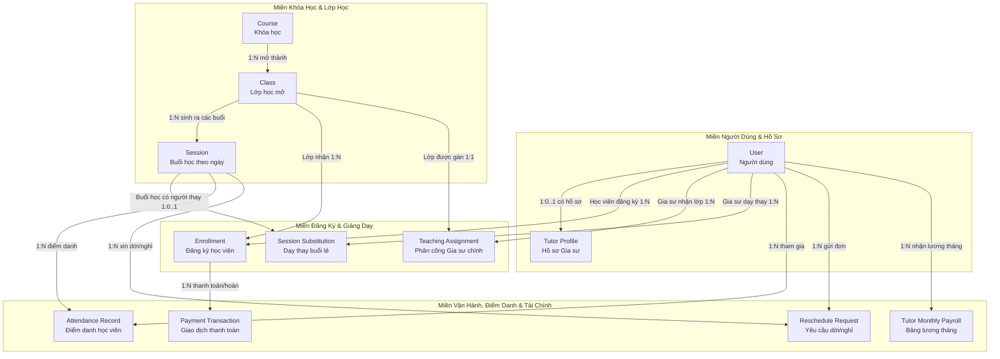

# Conceptual Data Model (Mô hình Dữ liệu Khái niệm)

Tài liệu này định nghĩa **Mô hình Dữ liệu Khái niệm (Conceptual Data Model)** cho hệ thống **VietTriTutor**.
Mô hình khái niệm tập trung vào **nghiệp vụ cấp cao**: các thực thể kinh doanh (Business Entities), ý nghĩa nghiệp vụ của chúng, và mối quan hệ ngữ nghĩa (Semantic Relationships) giữa các thực thể mà **hoàn toàn độc lập với công nghệ cơ sở dữ liệu (Database-agnostic)**.

---

## 1. Danh sách các Thực thể Khái niệm (Conceptual Entities)

Hệ thống VietTriTutor gồm **10 thực thể khái niệm nghiệp vụ** cốt lõi được gom thành 4 miền nghiệp vụ (Business Domains):

```text
Miền 1: Người dùng & Phân quyền (User & Identity Domain)
  1. User (Người dùng) - Tài khoản đại diện cho Admin, Gia sư Trung tâm, hoặc Học viên/Phụ huynh.
  2. Tutor Profile (Hồ sơ Gia sư) - Thông tin bổ sung, bằng cấp và cơ chế đãi ngộ của gia sư thuộc Trung tâm.

Miền 2: Đào tạo & Tổ chức Lớp (Academic & Class Organization Domain)
  3. Course (Khóa học) - Sản phẩm đào tạo gốc (Cấp 1/2/3, Môn học, Học phí chuẩn 1-1, Số buổi).
  4. Class (Lớp học) - Một đợt tổ chức học cụ thể với Mẫu lịch (2-4-6, 3-5-7), Khung giờ ca học, Sĩ số.
  5. Session (Buổi học) - Buổi học cụ thể theo từng ngày diễn ra trong thời gian khóa học.

Miền 3: Đăng ký & Giảng dạy (Enrollment & Teaching Domain)
  6. Enrollment (Đăng ký học) - Học viên ghi danh và đóng học phí trọn gói vào một Lớp học cụ thể.
  7. Teaching Assignment (Phân công Giảng dạy) - Trung tâm chỉ định một Gia sư phụ trách chính một Lớp học.
  8. Session Substitution (Dạy thay Buổi lẻ) - Phân công một Gia sư khác đứng lớp thay cho một buổi cụ thể.

Miền 4: Vận hành & Tài chính (Operations & Finance Domain)
  9. Attendance Record (Ghi nhận Điểm danh) - Kết quả tham gia buổi học của từng học viên (Có mặt, Vắng, Đi trễ, Nghỉ có phép).
 10. Reschedule Request (Yêu cầu Dời buổi / Báo vắng) - Đơn xin nghỉ và đề xuất dời lịch từ học viên hoặc gia sư.
 11. Payment Transaction (Giao dịch Thanh toán / Hoàn tiền) - Dòng tiền học phí đóng vào hoặc hoàn trả cho học viên.
 12. Tutor Monthly Payroll (Bảng Lương Tháng Gia sư) - Bảng quyết toán tiền lương cứng và thù lao dạy hợp lệ hàng tháng.
```

---

## 2. Bản đồ Thực thể Khái niệm & Mối quan hệ Ngữ nghĩa (Conceptual Entities & Relationships)

| Thực thể A | Mối quan hệ (Verb Phrase) | Bản số (Cardinality) | Thực thể B | Ý nghĩa Nghiệp vụ |
| :--- | :---: | :---: | :--- | :--- |
| **User** | mở rộng hồ sơ (has profile) | 1 — (0..1) | **Tutor Profile** | Một User nếu có vai trò `TUTOR` thì sẽ có một hồ sơ năng lực và thỏa thuận lương với Trung tâm. |
| **User (Student)** | đăng ký tham gia (enrolls in) | 1 — (0..N) | **Enrollment** | Một Học viên có thể đăng ký nhiều Lớp học khác nhau (miễn không trùng lịch). |
| **User (Tutor)** | được phân công chính (assigned to) | 1 — (0..N) | **Teaching Assignment** | Một Gia sư có thể được phân công dạy nhiều Lớp học (hệ thống chặn trùng lịch). |
| **Course** | được mở thành (instantiated into) | 1 — (0..N) | **Class** | Một Khóa học (Toán 12) có thể mở nhiều Lớp (Lớp 1-1, Lớp nhóm 2-4-6, Lớp nhóm 3-5-7). |
| **Class** | gồm nhiều (composed of) | 1 — (1..N) | **Session** | Mỗi Lớp học khi mở sẽ tự động sinh ra danh sách đầy đủ các Buổi học cụ thể theo mẫu lịch. |
| **Class** | tiếp nhận (receives) | 1 — (0..N) | **Enrollment** | Lớp 1-1 nhận tối đa 1 Enrollment; Lớp Nhóm nhận từ 2 đến 8 Enrollments. |
| **Class** | có người phụ trách (managed by) | 1 — (0..1) | **Teaching Assignment** | Mỗi Lớp chỉ có duy nhất 1 Gia sư chính tại một thời điểm do Trung tâm gán. |
| **Session** | ghi nhận tham gia (evaluates) | 1 — (0..N) | **Attendance Record** | Mỗi Buổi học sẽ tạo bản ghi điểm danh cho từng học viên active trong lớp. |
| **Session** | có thể phát sinh (may have) | 1 — (0..N) | **Reschedule Request** | Một Buổi học có thể có yêu cầu xin nghỉ từ học viên hoặc gia sư. |
| **Session** | có thể cần (may have) | 1 — (0..1) | **Session Substitution** | Nếu gia sư chính vắng, buổi học có thể được gán 1 gia sư dạy thay. |
| **Enrollment** | thanh toán qua (paid via) | 1 — (1..N) | **Payment Transaction** | Một lần đăng ký sinh ra giao dịch thu tiền ban đầu, và có thể có giao dịch hoàn tiền nếu hủy lớp. |
| **User (Tutor)** | nhận quyết toán (settled in) | 1 — (0..N) | **Tutor Monthly Payroll** | Hàng tháng mỗi gia sư được tính lương dựa trên số buổi dạy hợp lệ trong các Session đã hoàn thành. |

---

## 3. Sơ đồ Thực thể Khái niệm (Mermaid Conceptual Diagram)

Sơ đồ thể hiện các khái niệm nghiệp vụ và mối liên kết ngữ nghĩa không phụ thuộc vào cấu trúc bảng cơ sở dữ liệu:



---

## 4. Tóm tắt Ý nghĩa Nghiệp vụ Cốt lõi
1. **Tính độc lập công nghệ**: Mô hình này không quan tâm cơ sở dữ liệu là SQL (Postgres, MySQL) hay NoSQL.
2. **Nguyên tắc phân định rõ ràng**:
   - Khóa học (`Course`) là định nghĩa trừu tượng; Lớp học (`Class`) là thực thể tổ chức; Buổi học (`Session`) là thực thể thực thi theo thời gian thực.
   - Học viên liên kết với Lớp qua `Enrollment`; Gia sư liên kết với Lớp qua `Teaching Assignment`.
   - Mọi khoản tiền thu vào đi từ `Enrollment` $\rightarrow$ `Payment Transaction`. Mọi khoản tiền chi ra cho nhân sự đi từ `Session` $\rightarrow$ `Tutor Monthly Payroll`.
