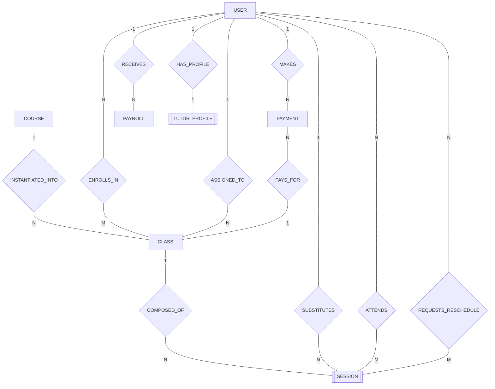
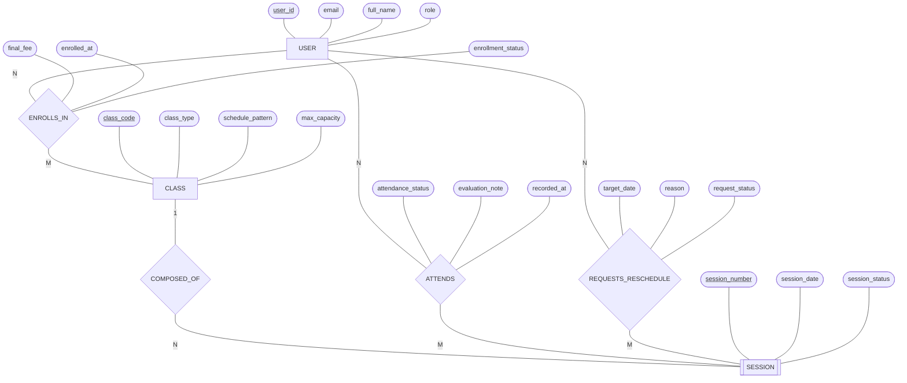

# Conceptual Data Model (Mô hình Dữ liệu Khái niệm)

Tài liệu này định nghĩa **Mô hình Dữ liệu Khái niệm (Conceptual Data Model)** cho hệ thống **VietTriTutor** tuân thủ nghiêm ngặt **Ký pháp Peter Chen (Chen's ER Notation, 1976)**.

Mô hình khái niệm tập trung vào **ngữ nghĩa nghiệp vụ cấp cao**: các thực thể kinh doanh cốt lõi (Business Entities), thuộc tính bản chất (Attributes), và mối quan hệ ngữ nghĩa (Semantic Relationships) mà **hoàn toàn độc lập với công nghệ cơ sở dữ liệu (Database-agnostic)**. Toàn bộ các bảng trung gian kỹ thuật (Junction / Associative Tables) đều được loại bỏ để giữ nguyên bản chất quan hệ nhiều - nhiều ($M:N$) nguyên bản kèm thuộc tính của quan hệ.

---

## 1. Danh sách các Thực thể Khái niệm (Conceptual Entities)

Hệ thống VietTriTutor gồm các thực thể kinh doanh thực tế được phân loại chuẩn theo Peter Chen:

### 1.1. Thực thể Mạnh (Strong Entities)
Các thực thể có sự tồn tại độc lập, sở hữu khóa định danh nội tại (Primary Key):
1. **`USER`** - Tài khoản người dùng trong hệ thống (Học viên, Phụ huynh, Gia sư, Quản trị viên).
2. **`COURSE`** - Khóa học chuẩn (sản phẩm đào tạo gốc: Toán 12, Tiếng Anh Cấp 3, v.v.).
3. **`CLASS`** - Lớp học cụ thể được mở từ Khóa học (mang mẫu lịch học, ca học, giới hạn sĩ số).
4. **`PAYMENT`** - Giao dịch tài chính thanh toán học phí hoặc hoàn tiền.
5. **`PAYROLL`** - Bảng quyết toán lương và thù lao hàng tháng cho gia sư.

### 1.2. Thực thể Yếu (Weak Entities)
Các thực thể mà sự tồn tại phụ thuộc hoàn toàn vào một thực thể cha (Existence Dependency):
1. **`TUTOR_PROFILE`** - Hồ sơ năng lực và cơ chế lương của gia sư, tồn tại phụ thuộc vào `USER`.
2. **`SESSION`** - Buổi học chi tiết theo ngày cụ thể, tồn tại phụ thuộc vào `CLASS`.

> [!IMPORTANT]
> **Loại bỏ Bảng trung gian Kỹ thuật ở Tầng Khái niệm**:
> Trong mô hình logic quan hệ (Relational 3NF), các bảng như `enrollments`, `tutor_assignments`, `session_substitutions`, `attendances`, `reschedule_requests` thường được tạo ra để giải quyết khóa ngoại. Tuy nhiên, theo **chuẩn Peter Chen thuần túy ở tầng Khái niệm**, chúng **không phải là thực thể độc lập** mà chính là **Mối quan hệ ngữ nghĩa (Semantic Relationships)** trực tiếp giữa các Thực thể (ví dụ quan hệ $M:N$ `ENROLLS_IN`, `ATTENDS`), và các thuộc tính liên quan được gắn trực tiếp vào hình thoi quan hệ.

---

## 2. Bản đồ Thực thể & Mối quan hệ Ngữ nghĩa (Conceptual Relationships Map)

| Thực thể A | Mối quan hệ (`VERB_PHRASE`) | Bản số (Cardinality) | Thực thể B | Thuộc tính Mối quan hệ (nếu có) | Ý nghĩa Nghiệp vụ |
| :--- | :---: | :---: | :--- | :--- | :--- |
| **USER** | `HAS_PROFILE` | 1 — 1 | **TUTOR_PROFILE** | Không | Một User nếu là Gia sư sẽ có một hồ sơ năng lực và chế độ đãi ngộ. |
| **COURSE** | `INSTANTIATED_INTO` | 1 — N | **CLASS** | Không | Một Khóa học chuẩn được mở thành nhiều Lớp học cụ thể. |
| **CLASS** | `COMPOSED_OF` | 1 — N | **SESSION** | Không | Một Lớp học bao gồm danh sách đầy đủ các Buổi học theo lịch. |
| **USER** | `ENROLLS_IN` | N — M | **CLASS** | `final_fee` `enrolled_at` `enrollment_status` | Học viên đăng ký học nhiều Lớp; Lớp tiếp nhận nhiều Học viên ($M:N$). |
| **USER** | `ASSIGNED_TO` | 1 — N | **CLASS** | `assigned_at` `assignment_status` | Một Gia sư được Trung tâm phân công quản lý và dạy chính nhiều Lớp học. |
| **USER** | `SUBSTITUTES` | 1 — N | **SESSION** | `substitute_rate` `substitute_reason` | Một Gia sư có thể được điều phối dạy thay cho nhiều Buổi học lẻ. |
| **USER** | `ATTENDS` | N — M | **SESSION** | `attendance_status` `evaluation_note` `recorded_at` | Học viên tham gia nhiều Buổi học; Buổi học đánh giá nhiều Học viên ($M:N$). |
| **USER** | `REQUESTS_RESCHEDULE` | N — M | **SESSION** | `target_date` `reason` `request_status` | Người dùng (Học viên/Gia sư) gửi đơn xin dời hoặc báo nghỉ cho Buổi học ($M:N$). |
| **USER** | `MAKES` | 1 — N | **PAYMENT** | Không | Học viên thực hiện các giao dịch thanh toán học phí. |
| **PAYMENT** | `PAYS_FOR` | N — 1 | **CLASS** | Không | Giao dịch thanh toán được ghi nhận cho một Lớp học cụ thể. |
| **USER** | `RECEIVES` | 1 — N | **PAYROLL** | Không | Gia sư nhận các bảng quyết toán tiền lương hàng tháng từ Trung tâm. |

---

## 3. Sơ đồ Thực thể Khái niệm theo Chuẩn Peter Chen (Mermaid Flowchart)

### 3.1. Quy ước Hình khối & Ký pháp Peter Chen (1976)
- **Thực thể Mạnh (Strong Entity)**: Bắt buộc dùng hình chữ nhật `[ENTITY]`.
- **Thực thể Yếu (Weak Entity)**: Bắt buộc dùng hình chữ nhật nét đôi `[[WEAK_ENTITY]]`.
- **Mối quan hệ (Relationship)**: Bắt buộc dùng hình thoi `{"VERB_PHRASE"}` (động từ/cụm động từ tiếng Anh viết hoa).
- **Thuộc tính (Attribute)**: Biểu diễn bằng hình oval `([attribute_name])`.
- **Thuộc tính Khóa (Key Attribute)**: Hình oval có gạch chân `([<u>key_attribute</u>])`.
- **Thuộc tính của Quan hệ $M:N$**: Nối trực tiếp vào hình thoi của mối quan hệ.
- **Bản số (Cardinality)**: Đặt ở hai đầu đường nối vô hướng, **chỉ sử dụng `"1"`, `"N"`, `"M"`**. Tuyệt đối không dùng ký hiệu phân dải logic ($0..1$, $1..N$, $0..N$).

---

### 3.2. Sơ đồ Tổng quan Toàn hệ thống (Conceptual Chen ERD - Global View)

Sơ đồ thể hiện toàn bộ các thực thể mạnh, thực thể yếu, và các mối quan hệ ngữ nghĩa chuẩn hóa với bản số `"1"`, `"N"`, `"M"`:

---

### 3.3. Sơ đồ Chi tiết Thuộc tính & Thuộc tính Quan hệ $M:N$ (Chen ERD with Attributes)

Sơ đồ dưới đây minh họa chuẩn xác ký pháp Peter Chen hoàn chỉnh với các **Hình oval thuộc tính**, **gạch chân thuộc tính khóa**, và **thuộc tính mô tả của quan hệ $M:N$ được gắn trực tiếp vào hình thoi**:

---

## 4. Tóm tắt Ý nghĩa Nghiệp vụ Cốt lõi & Đối sánh Mô hình

1. **Chuẩn hóa Ngữ nghĩa Peter Chen**:
   - Ở tầng Khái niệm (Conceptual), trọng tâm là mô tả thực tế khách quan của nghiệp vụ, không bị trói buộc bởi kỹ thuật cơ sở dữ liệu.
   - Các bảng trung gian (Junction Tables) hoàn toàn không xuất hiện; thay vào đó là các mối quan hệ nhiều - nhiều ($M:N$) tự nhiên mang theo thuộc tính quan hệ (ví dụ: `ENROLLS_IN` sở hữu `final_fee` và `enrolled_at`).
2. **Nguyên tắc Phân định Rõ ràng**:
   - Khóa học (`COURSE`) là định nghĩa trừu tượng; Lớp học (`CLASS`) là thực thể tổ chức; Buổi học (`SESSION`) là thực thể thực thi theo thời gian thực (phụ thuộc yếu vào `CLASS`).
   - Học viên liên kết với Lớp qua quan hệ $M:N$ `ENROLLS_IN`; Gia sư liên kết với Lớp qua quan hệ $1:N$ `ASSIGNED_TO`.
   - Dòng tiền thu vào gắn với Lớp học qua `PAYMENT`, dòng tiền chi trả nhân sự gắn với Gia sư qua `PAYROLL`.
3. **Cầu nối sang Mô hình Logic**:
   - Khi chuyển từ mô hình này sang `03-Logical-Data-Model.md` (chuẩn 3NF), các mối quan hệ $M:N$ (`ENROLLS_IN`, `ATTENDS`, `REQUESTS_RESCHEDULE`) cùng với các thuộc tính quan hệ của chúng sẽ được cụ thể hóa thành các bảng quan hệ tương ứng (`enrollments`, `attendances`, `reschedule_requests`) với các cặp khóa ngoại ($FK$).
