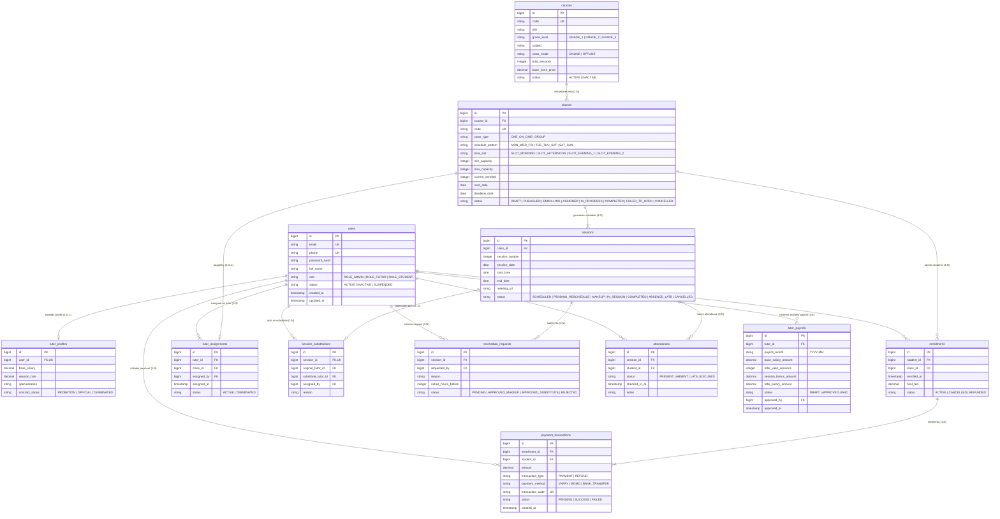

# Logical Data Model (Mô hình Dữ liệu Logic)

Tài liệu này chi tiết hóa **Mô hình Dữ liệu Logic (Logical Data Model)** cho hệ thống **VietTriTutor**.
Mô hình logic chuyển hóa các khái niệm nghiệp vụ từ `Conceptual Model` thành **cấu trúc quan hệ chuẩn hóa (Relational Entities)**, chuẩn hóa mức **3NF (Third Normal Form)**, xác định các Khóa chính (Primary Key), Khóa ngoại (Foreign Key), các thuộc tính logic, ràng buộc toàn vẹn (Integrity Constraints) và các kiểu liệt kê (Enumerations).

---

## 1. Danh sách Thực thể Logic & Khóa (Entities & Logical Keys)

| Thực thể Logic (Table) | Khóa chính (PK) | Khóa ngoại (FK) & Tham chiếu | Ý nghĩa Quan hệ |
| :--- | :--- | :--- | :--- |
| **users** | `id` | Không | Thực thể người dùng gốc. |
| **tutor_profiles** | `id` | `user_id` $\rightarrow$ `users(id)` | Quan hệ 1:1 mở rộng cho gia sư Trung tâm. |
| **courses** | `id` | Không | Danh mục khóa học chuẩn. |
| **classes** | `id` | `course_id` $\rightarrow$ `courses(id)` | Quan hệ 1:N giữa khóa học và các lớp mở. |
| **sessions** | `id` | `class_id` $\rightarrow$ `classes(id)` | Quan hệ 1:N giữa lớp và các buổi học cụ thể. |
| **enrollments** | `id` | `student_id` $\rightarrow$ `users(id)` `class_id` $\rightarrow$ `classes(id)` | Quan hệ N:N giữa Học viên và Lớp học (được giải quyết qua bảng liên kết). |
| **tutor_assignments** | `id` | `tutor_id` $\rightarrow$ `users(id)` `class_id` $\rightarrow$ `classes(id)` `assigned_by` $\rightarrow$ `users(id)` | Phân công gia sư chính chịu trách nhiệm một lớp. |
| **session_substitutions** | `id` | `session_id` $\rightarrow$ `sessions(id)` `original_tutor_id` $\rightarrow$ `users(id)` `substitute_tutor_id` $\rightarrow$ `users(id)` `assigned_by` $\rightarrow$ `users(id)` | Ghi nhận phân công dạy thay ca lẻ. |
| **reschedule_requests** | `id` | `session_id` $\rightarrow$ `sessions(id)` `requested_by` $\rightarrow$ `users(id)` | Đơn xin dời lịch / báo nghỉ buổi học. |
| **attendances** | `id` | `session_id` $\rightarrow$ `sessions(id)` `student_id` $\rightarrow$ `users(id)` | Bản ghi điểm danh từng học viên theo buổi học. |
| **payment_transactions** | `id` | `enrollment_id` $\rightarrow$ `enrollments(id)` `student_id` $\rightarrow$ `users(id)` | Giao dịch tài chính thanh toán học phí hoặc hoàn tiền. |
| **tutor_payrolls** | `id` | `tutor_id` $\rightarrow$ `users(id)` `approved_by` $\rightarrow$ `users(id)` | Bảng tổng kết tiền lương tháng của gia sư. |

---

## 2. Chi tiết Thuộc tính & Ràng buộc Toàn vẹn (Logical Schema & Constraints)

### 2.1. Nhóm Người dùng & Phân quyền

#### `users`
- `id`: Identifier (PK, Not Null, Unique)
- `email`: String (Not Null, Unique) - Địa chỉ email định danh đăng nhập.
- `phone`: String (Not Null, Unique) - Số điện thoại liên hệ.
- `password_hash`: String (Not Null) - Mật khẩu đã mã hóa.
- `full_name`: String (Not Null) - Họ và tên hiển thị.
- `role`: Enum (`ROLE_ADMIN`, `ROLE_TUTOR`, `ROLE_STUDENT`) (Not Null).
- `status`: Enum (`ACTIVE`, `INACTIVE`, `SUSPENDED`) (Not Null).
- `created_at`, `updated_at`: Timestamp (Not Null).

#### `tutor_profiles`
- `id`: Identifier (PK, Not Null)
- `user_id`: Identifier (FK $\rightarrow$ `users.id`, Not Null, Unique 1:1)
- `base_salary`: Decimal (Not Null, $\ge 0$) - Lương cứng cố định theo hợp đồng lao động.
- `session_rate`: Decimal (Not Null, $\ge 0$) - Thù lao nhận được cho mỗi buổi dạy hợp lệ.
- `specialization`: String (Nullable) - Chuyên môn (Toán, Lý, Hóa, Tiếng Anh...).
- `contract_status`: Enum (`PROBATION`, `OFFICIAL`, `TERMINATED`) (Not Null).

---

### 2.2. Nhóm Khóa học, Lớp học & Buổi học

#### `courses`
- `id`: Identifier (PK, Not Null)
- `code`: String (Not Null, Unique) - Mã định danh khóa học (VD: `MATH-12-STD`).
- `title`: String (Not Null) - Tên khóa học (VD: "Toán 12 Luyện thi Tốt nghiệp THPT").
- `grade_level`: Enum (`GRADE_1`, `GRADE_2`, `GRADE_3`) (Not Null) - Cấp 1, Cấp 2, Cấp 3.
- `subject`: String (Not Null) - Môn học.
- `class_mode`: Enum (`ONLINE`, `OFFLINE`) (Not Null).
- `total_sessions`: Integer (Not Null, $> 0$) - Tổng số buổi học trong toàn khóa.
- `base_1on1_price`: Decimal (Not Null, $> 0$) - Giá học phí trọn gói chuẩn áp dụng cho lớp 1-1.
- `status`: Enum (`ACTIVE`, `INACTIVE`) (Not Null).

#### `classes`
- `id`: Identifier (PK, Not Null)
- `course_id`: Identifier (FK $\rightarrow$ `courses.id`, Not Null)
- `code`: String (Not Null, Unique) - Mã lớp học (VD: `CLS-2026-M12-01`).
- `class_type`: Enum (`ONE_ON_ONE`, `GROUP`) (Not Null).
- `schedule_pattern`: Enum (`MON_WED_FRI`, `TUE_THU_SAT`, `SAT_SUN`) (Not Null).
- `time_slot`: Enum (`SLOT_MORNING`, `SLOT_AFTERNOON`, `SLOT_EVENING_1`, `SLOT_EVENING_2`) (Not Null).
- `min_capacity`: Integer (Not Null) - `ONE_ON_ONE`: 1, `GROUP`: 2.
- `max_capacity`: Integer (Not Null) - `ONE_ON_ONE`: 1, `GROUP`: 8.
- `current_enrolled`: Integer (Not Null, Default 0, $\le$ `max_capacity`).
- `start_date`: Date (Not Null) - Ngày dự kiến khai giảng.
- `deadline_date`: Date (Not Null) - Hạn chốt nhận đăng ký (mặc định 3 ngày trước `start_date`).
- `status`: Enum (`DRAFT`, `PUBLISHED`, `ENROLLING`, `ASSIGNED`, `IN_PROGRESS`, `COMPLETED`, `FAILED_TO_OPEN`, `CANCELLED`) (Not Null).

#### `sessions`
- `id`: Identifier (PK, Not Null)
- `class_id`: Identifier (FK $\rightarrow$ `classes.id`, Not Null)
- `session_number`: Integer (Not Null) - Buổi số mấy trong khóa (1, 2, 3...).
- `session_date`: Date (Not Null) - Ngày diễn ra buổi học.
- `start_time`: Time (Not Null) - Giờ bắt đầu (VD: 18:00).
- `end_time`: Time (Not Null) - Giờ kết thúc (VD: 20:00).
- `meeting_url`: String (Nullable) - Đường dẫn phòng họp trực tuyến (cho lớp Online).
- `status`: Enum (`SCHEDULED`, `PENDING_RESCHEDULE`, `MAKEUP`, `IN_SESSION`, `COMPLETED`, `ABSENCE_LATE`, `CANCELLED`) (Not Null).

---

### 2.3. Nhóm Đăng ký, Phân công & Lịch dạy

#### `enrollments`
- `id`: Identifier (PK, Not Null)
- `student_id`: Identifier (FK $\rightarrow$ `users.id`, Not Null)
- `class_id`: Identifier (FK $\rightarrow$ `classes.id`, Not Null)
- `enrolled_at`: Timestamp (Not Null) - Thời điểm thanh toán thành công và ghi danh.
- `final_fee`: Decimal (Not Null, $> 0$) - Học phí thực tế phải đóng sau khi áp dụng chiết khấu nhóm.
- `status`: Enum (`ACTIVE`, `CANCELLED`, `REFUNDED`) (Not Null).
- **Ràng buộc duy nhất**: `(student_id, class_id)` là duy nhất đối với các bản ghi `ACTIVE`.

#### `tutor_assignments`
- `id`: Identifier (PK, Not Null)
- `tutor_id`: Identifier (FK $\rightarrow$ `users.id`, Not Null)
- `class_id`: Identifier (FK $\rightarrow$ `classes.id`, Not Null)
- `assigned_by`: Identifier (FK $\rightarrow$ `users.id`, Not Null) - Admin thực hiện phân công.
- `assigned_at`: Timestamp (Not Null).
- `status`: Enum (`ACTIVE`, `TERMINATED`) (Not Null).
- **Ràng buộc**: Mỗi lớp chỉ có đúng 1 bản ghi `ACTIVE` tại một thời điểm.

#### `session_substitutions`
- `id`: Identifier (PK, Not Null)
- `session_id`: Identifier (FK $\rightarrow$ `sessions.id`, Not Null, Unique 1:1)
- `original_tutor_id`: Identifier (FK $\rightarrow$ `users.id`, Not Null)
- `substitute_tutor_id`: Identifier (FK $\rightarrow$ `users.id`, Not Null)
- `assigned_by`: Identifier (FK $\rightarrow$ `users.id`, Not Null) - Admin thực hiện gán dạy thay.
- `reason`: String (Nullable).

---

### 2.4. Nhóm Vận hành, Điểm danh & Tài chính

#### `reschedule_requests`
- `id`: Identifier (PK, Not Null)
- `session_id`: Identifier (FK $\rightarrow$ `sessions.id`, Not Null)
- `requested_by`: Identifier (FK $\rightarrow$ `users.id`, Not Null)
- `reason`: String (Not Null)
- `notice_hours_before`: Integer (Not Null) - Số giờ báo trước so với giờ bắt đầu buổi học ($\ge 24$h hay $< 24$h).
- `status`: Enum (`PENDING`, `APPROVED_MAKEUP`, `APPROVED_SUBSTITUTE`, `REJECTED`) (Not Null).

#### `attendances`
- `id`: Identifier (PK, Not Null)
- `session_id`: Identifier (FK $\rightarrow$ `sessions.id`, Not Null)
- `student_id`: Identifier (FK $\rightarrow$ `users.id`, Not Null)
- `status`: Enum (`PRESENT`, `ABSENT`, `LATE`, `EXCUSED`) (Not Null).
- `checked_in_at`: Timestamp (Nullable).
- `notes`: String (Nullable).
- **Ràng buộc duy nhất**: Cặp `(session_id, student_id)` là duy nhất.

#### `payment_transactions`
- `id`: Identifier (PK, Not Null)
- `enrollment_id`: Identifier (FK $\rightarrow$ `enrollments.id`, Not Null)
- `student_id`: Identifier (FK $\rightarrow$ `users.id`, Not Null)
- `amount`: Decimal (Not Null, $> 0$)
- `transaction_type`: Enum (`PAYMENT`, `REFUND`) (Not Null).
- `payment_method`: Enum (`VNPAY`, `MOMO`, `BANK_TRANSFER`) (Not Null).
- `transaction_code`: String (Not Null, Unique).
- `status`: Enum (`PENDING`, `SUCCESS`, `FAILED`) (Not Null).
- `created_at`: Timestamp (Not Null).

#### `tutor_payrolls`
- `id`: Identifier (PK, Not Null)
- `tutor_id`: Identifier (FK $\rightarrow$ `users.id`, Not Null)
- `payroll_month`: String (Not Null) - Tháng quyết toán lương định dạng `YYYY-MM`.
- `base_salary_amount`: Decimal (Not Null, $\ge 0$) - Lương cứng theo hợp đồng.
- `total_valid_sessions`: Integer (Not Null, $\ge 0$) - Số buổi dạy `COMPLETED` hợp lệ (gồm cả dạy thay).
- `session_bonus_amount`: Decimal (Not Null, $\ge 0$) - Tiền thưởng tính theo số buổi dạy $\times$ đơn giá.
- `total_salary_amount`: Decimal (Not Null, $\ge 0$) - Tổng thực nhận = `base_salary_amount` + `session_bonus_amount`.
- `status`: Enum (`DRAFT`, `APPROVED`, `PAID`) (Not Null).
- `approved_by`: Identifier (FK $\rightarrow$ `users.id`, Nullable) - Admin phê duyệt.
- `approved_at`: Timestamp (Nullable).
- **Ràng buộc duy nhất**: Cặp `(tutor_id, payroll_month)` là duy nhất.

---

## 3. Sơ đồ Quan hệ Logic (Mermaid Logical ERD Diagram)

