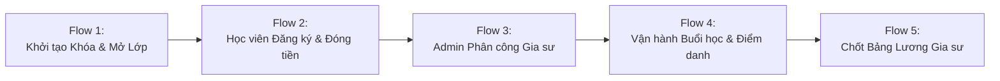
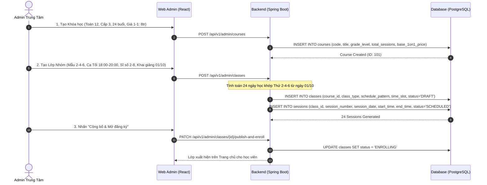
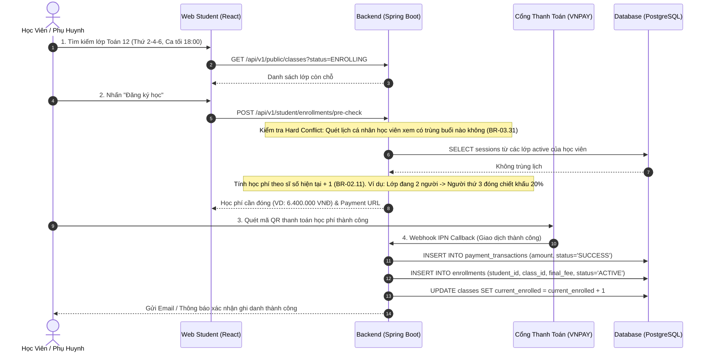
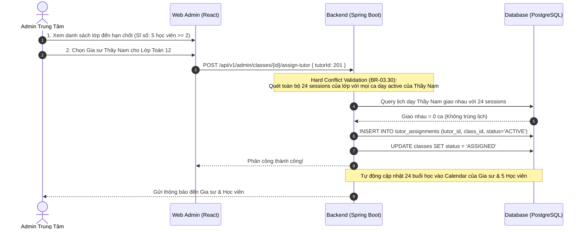
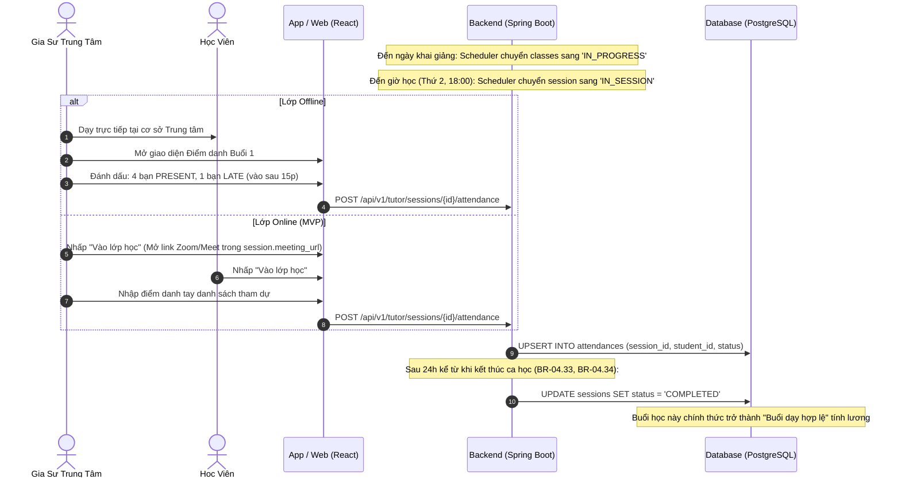
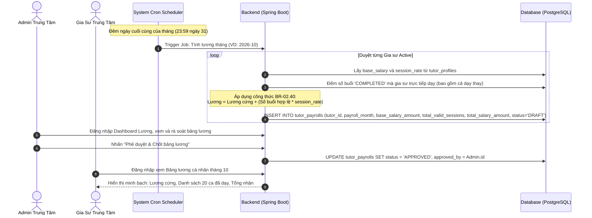

# Main Business Flows (Happy Path Workflows)

Tài liệu này hệ thống hóa các **Luồng Nghiệp vụ Chính (Main Flows / Happy Paths)** của hệ thống **VietTriTutor**.
Mỗi luồng mô tả hành trình lý tưởng từ khi bắt đầu đến khi hoàn tất thành công, liên kết chặt chẽ giữa Hành động Người dùng, Phản hồi Hệ thống, Thay đổi Trạng thái Dữ liệu (State Transitions) và Các Bảng bị tác động.

---

## 1. Bản Đồ 5 Luồng Chính Trong Hệ Thống (Happy Path Map)

---

## 2. Chi tiết Từng Luồng Nghiệp Vụ Chính (Detailed Flows)

### 2.1. Flow 1: Tạo Khóa Học, Lớp Học & Tự Động Sinh Buổi Học (Course & Class Setup)

**Mục tiêu**: Admin thiết lập chương trình học và mở các lớp đón học viên đăng ký.

- **Thay đổi trạng thái**: `classes.status`: `DRAFT` $\rightarrow$ `ENROLLING`.
- **Dữ liệu sinh ra**: 1 bản ghi `courses`, 1 bản ghi `classes`, 24 bản ghi `sessions` (`SCHEDULED`).

---

### 2.2. Flow 2: Học Viên Khám Phá, Đăng Ký & Thanh Toán (Enrollment & Payment)

**Mục tiêu**: Học viên tìm kiếm lớp phù hợp, kiểm tra không bị trùng lịch cá nhân, thanh toán 100% và nhận biên lai ghi danh.

- **Thay đổi trạng thái**: 
  - `classes.current_enrolled` tăng thêm 1. (Nếu đạt 8 $\rightarrow$ chuyển `status = 'FULL'`).
- **Dữ liệu sinh ra**: 1 bản ghi `enrollments`, 1 bản ghi `payment_transactions`.

---

### 2.3. Flow 3: Trung Tâm Phân Công Gia Sư Vào Lớp (Tutor Assignment & Conflict Check)

**Mục tiêu**: Tại hạn chốt đăng ký, lớp nhóm đạt sĩ số hợp lệ ($\ge 2$ học viên), Admin phân công Gia sư Trung tâm phụ trách lớp mà không bị trùng lịch dạy.

- **Thay đổi trạng thái**: `classes.status`: `ENROLLING` $\rightarrow$ `ASSIGNED`.
- **Dữ liệu sinh ra**: 1 bản ghi `tutor_assignments` (`ACTIVE`).

---

### 2.4. Flow 4: Vận Hành Buổi Học & Điểm Danh (Session Execution & Attendance)

**Mục tiêu**: Lớp học bước vào giai đoạn khai giảng (`IN_PROGRESS`), gia sư giảng dạy buổi học và chốt điểm danh.

- **Thay đổi trạng thái**: `sessions.status`: `SCHEDULED` $\rightarrow$ `IN_SESSION` $\rightarrow$ `COMPLETED`.
- **Dữ liệu sinh ra**: 5 bản ghi `attendances`.

---

### 2.5. Flow 5: Quyết Toán & Chốt Bảng Lương Gia Sư Hàng Tháng (Monthly Payroll Settlement)

**Mục tiêu**: Cuối tháng dương lịch, hệ thống tự động tổng hợp số buổi dạy thực tế để tạo bảng lương minh bạch cho từng Gia sư.

- **Thay đổi trạng thái**: `tutor_payrolls.status`: `DRAFT` $\rightarrow$ `APPROVED` $\rightarrow$ `PAID`.
- **Dữ liệu sinh ra**: Bản ghi `tutor_payrolls` tương ứng cho từng gia sư.
