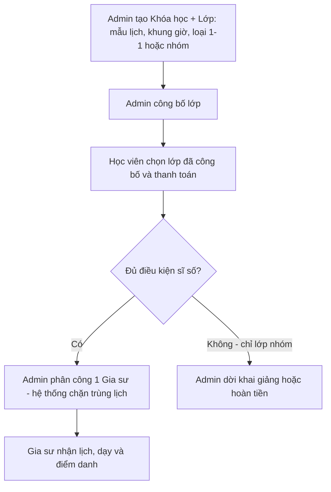

# Business Rule 01: Vai trò người dùng & Phân quyền

Tài liệu này định nghĩa **ai được làm gì** trong hệ thống VietTriTutor. Mọi quy tắc ở các file 02, 03, 04 đều dựa trên 3 vai trò và thuật ngữ dưới đây.

---

## 0. Thuật ngữ dùng chung (Glossary)

| Thuật ngữ | Mã hệ thống | Ý nghĩa |
| :--- | :--- | :--- |
| **Khóa học** | `Course` | Sản phẩm do Admin tạo: môn học, cấp học, hình thức (Online/Offline), thời lượng, học phí gốc 1-1. |
| **Lớp** | `Class` | Một lần mở của khóa học, gắn **mẫu lịch + khung giờ**, có sĩ số và vòng đời riêng. |
| **Mẫu lịch** | `SchedulePattern` | Lịch cố định theo tuần: `MON_WED_FRI` (2-4-6), `TUE_THU_SAT` (3-5-7), `SAT_SUN` (7-CN). |
| **Khung giờ** | `TimeSlot` | Khoảng giờ dạy: ca sáng, chiều, tối. Admin chọn khi tạo lớp, học viên **không tự đặt giờ**. |
| **Buổi học** | `Session` | Một buổi cụ thể theo ngày (ví dụ: Thứ 2, 08:00–10:00, 15/09/2026). |
| **Đăng ký** | `Enrollment` | Quan hệ Học viên–Lớp sau khi thanh toán thành công. Học phí được **chốt** tại thời điểm này. |
| **Phân công** | `Assignment` | Admin gán **một** Gia sư Trung tâm vào một Lớp sau khi lớp đủ điều kiện mở. |

---

## 1. Mô hình vận hành (BR-01)

Hệ thống là **trung tâm gia sư tập trung**, không phải chợ gia sư tự do.

| Mã | Quy tắc |
| :--- | :--- |
| **BR-01.01** | Không tồn tại gia sư freelance. Mọi gia sư đều thuộc Trung tâm, đã kiểm định bằng cấp/hợp đồng. |
| **BR-01.02** | Trung tâm **không bán gói subscription** cho gia sư. Doanh thu chỉ đến từ **học phí khóa học** do học viên đóng. |
| **BR-01.03** | Học viên **không tự chọn gia sư**. Học viên chọn lớp (khóa + mẫu lịch + khung giờ) đã được Admin công bố. Admin phân công gia sư. |
| **BR-01.04** | Phụ huynh và học viên dùng chung vai trò `ROLE_STUDENT`. Một tài khoản đại diện người đăng ký, thanh toán và theo dõi lớp. |

---

## 2. Ba vai trò chính

| Vai trò | Mã | Trách nhiệm cốt lõi |
| :--- | :--- | :--- |
| **Admin Trung tâm** | `ROLE_ADMIN` | Tạo khóa/lớp, cấu hình học phí, duyệt đăng ký, phân công gia sư, xử lý dời lịch, chốt lương tháng. |
| **Gia sư Trung tâm** | `ROLE_TUTOR` | Cập nhật lịch rảnh, nhận phân công, dạy, điểm danh. Nhận lương tháng từ Trung tâm. |
| **Học viên / Phụ huynh** | `ROLE_STUDENT` | Xem lớp đang mở, đăng ký, thanh toán, xem lịch, xin nghỉ, xem điểm danh. |

---

## 3. Ma trận phân quyền (BR-01.10)

Ký hiệu: **C** = được làm · **X** = không được làm · **R** = chỉ xem dữ liệu của mình.

| Chức năng | Admin | Gia sư | Học viên |
| :--- | :---: | :---: | :---: |
| Tạo / sửa / ẩn khóa học & lớp | C | X | X |
| Công bố lớp (`PUBLISHED`) và mở đăng ký | C | X | X |
| Cấu hình học phí gốc & loại lớp (1-1 / nhóm) | C | X | X |
| Xem danh mục lớp đang mở | C | R | C |
| Đăng ký lớp & thanh toán học phí | X | X | C |
| Duyệt / hoàn tiền khi lớp không mở được | C | X | R |
| Cập nhật lịch rảnh cá nhân | X | C | X |
| Phân công gia sư vào lớp | C | X | X |
| Dạy buổi học & điểm danh | C (can thiệp) | C (lớp được gán) | X |
| Xin nghỉ / đề nghị dời buổi | C | C | C |
| Xếp buổi bù hoặc gia sư dạy thay | C | X | X |
| Xem bảng lương tháng | C | R | X |
| Chốt & chi trả lương tháng | C | X | X |
| Tham gia buổi Online / check-in Offline | C | C | C |

**BR-01.11** — Gia sư chỉ xem và thao tác trên **lớp/buổi đã được phân công**. Không xem học phí từng học viên, không xem lương gia sư khác.

**BR-01.12** — Học viên chỉ xem **lớp đang `PUBLISHED`/`ENROLLING`** và **lớp mình đã đăng ký**. Không xem thông tin lương, hồ sơ nhân sự gia sư.

---

## 4. Luồng trách nhiệm khi mở một lớp

