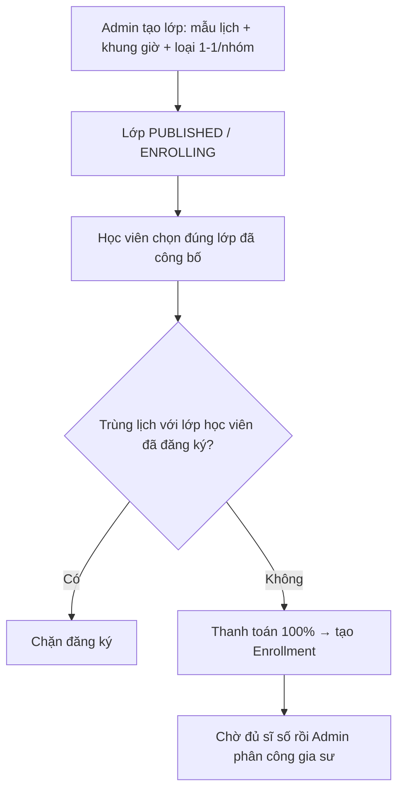
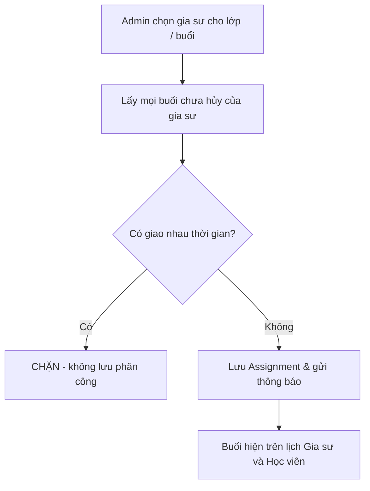

# Business Rule 03: Lịch học, phân công gia sư & Xử lý trùng / dời lịch

Tài liệu này chốt **cách tạo lịch**, **ai được gán dạy**, và **xử lý nghỉ/dời buổi**. Học viên chỉ chọn lớp Admin đã công bố, không tự soạn thời khóa biểu.

---

## 1. Tạo lịch khi mở lớp (BR-03)

Mỗi lớp bắt buộc có đúng **một mẫu lịch** và **một khung giờ**.

### 1.1. Mẫu lịch theo tuần

| Mã | Ngày học | Ghi chú |
| :--- | :--- | :--- |
| `MON_WED_FRI` | Thứ 2 – 4 – 6 | Lịch ngày thường chẵn. |
| `TUE_THU_SAT` | Thứ 3 – 5 – 7 | Lịch ngày thường lẻ + Thứ 7. |
| `SAT_SUN` | Thứ 7 – Chủ nhật | Lịch cuối tuần. |

**BR-03.01** — Không cho lớp dùng lịch tùy ý (ví dụ chỉ Thứ 2). Muốn lịch khác phải tạo lớp mới.

### 1.2. Khung giờ chuẩn

| Mã ca | Giờ bắt đầu | Giờ kết thúc |
| :--- | :---: | :---: |
| `SLOT_MORNING` | 08:00 | 10:00 |
| `SLOT_AFTERNOON` | 14:00 | 16:00 |
| `SLOT_EVENING_1` | 18:00 | 20:00 |
| `SLOT_EVENING_2` | 19:30 | 21:30 |

**BR-03.02** — Hai khung tối `18:00–20:00` và `19:30–21:30` **trùng 30 phút**. Hệ thống phải chặn nếu cùng người (gia sư hoặc học viên) bị gán/đăng ký cả hai.

**BR-03.03** — Khi Admin công bố lớp, hệ thống sinh sẵn danh sách `Session` theo mẫu lịch, khung giờ, ngày khai giảng và số buổi của khóa.

---

## 2. Học viên chọn lớp (không chọn gia sư)

**BR-03.10** — Học viên không gửi “yêu cầu lịch riêng”. Chỉ đăng ký các lớp đang `PUBLISHED` hoặc `ENROLLING` còn chỗ.

---

## 3. Thời điểm phân công gia sư

| Loại lớp | Khi nào Admin được gán gia sư |
| :--- | :--- |
| `ONE_ON_ONE` | Sau enrollment thành công. |
| `GROUP` | Sau hạn chốt, sĩ số \(\ge 2\). |

**BR-03.20** — Mỗi lớp chỉ có **một gia sư chính** tại một thời điểm. Đổi gia sư chính hoặc xếp dạy thay do Admin thực hiện, vẫn phải qua bước chặn trùng lịch.

**BR-03.21** — Lịch rảnh do gia sư khai báo chỉ là **gợi ý** cho Admin. Nguồn sự thật để chặn trùng là các buổi `Assignment`/`Session` đã gán, không phải lịch rảnh.

---

## 4. Chặn trùng lịch (Hard conflict)

**Định nghĩa trùng:** hai buổi của cùng một người có khoảng thời gian giao nhau **từ 1 phút trở lên**. Cảnh báo nghiệp vụ dùng mốc 15 phút để Admin hiểu: mọi giao nhau đều bị chặn, kể cả 15 phút.

Áp dụng cho:

1. **Gia sư** khi Admin phân công / dạy thay / xếp buổi bù.
2. **Học viên** khi đăng ký thêm lớp (so với mọi enrollment còn hiệu lực).

**BR-03.30** — Nếu trùng, hệ thống **không lưu** phân công và báo:

> Gia sư [Tên] đã có ca lớp [Mã lớp] từ [HH:mm] đến [HH:mm] vào [Thứ X, dd/MM/yyyy]. Vui lòng chọn gia sư khác.

**BR-03.31** — Học viên trùng lịch: chặn enrollment, thông báo tương tự với tên lớp đã đăng ký.

**BR-03.32** — Buổi đã `CANCELLED` không tham gia kiểm tra trùng.

---

## 5. Xin nghỉ và dời buổi (BR-03.40)

### 5.1. Thời hạn báo nghỉ

| Thời điểm gửi yêu cầu | Trạng thái buổi | Hệ thống xử lý |
| :--- | :--- | :--- |
| \(\ge 24\) giờ trước giờ bắt đầu | `PENDING_RESCHEDULE` | Admin bắt buộc chọn phương án trong mục 5.2 / 5.3. |
| \(< 24\) giờ | `ABSENCE_LATE` | Không đảm bảo học bù. Xem bảng dưới. |

### 5.2. Nghỉ do gia sư (\(\ge 24\) giờ)

Admin chọn **một**:

1. **Học bù:** tạo buổi `MAKEUP` vào khung cả gia sư và **toàn bộ học viên còn active** đều rảnh (qua cùng bộ chặn trùng).
2. **Dạy thay:** gán gia sư Trung tâm khác rảnh đúng buổi đó. Buổi giữ nguyên thời điểm.

Không xếp được bù/thay trước giờ học → buổi `CANCELLED`; Admin hẹn lại buổi bù sau.

### 5.3. Nghỉ do học viên

| Loại lớp | \(\ge 24\) giờ | \(< 24\) giờ |
| :--- | :--- | :--- |
| `ONE_ON_ONE` | Admin xếp buổi bù (cùng quy tắc trùng lịch). | Buổi vẫn diễn ra nếu gia sư sẵn sàng; học viên `ABSENT`. Không mặc định có buổi bù. |
| `GROUP` | Buổi **vẫn dạy** cho các học viên còn lại. Học viên nghỉ = `ABSENT`. Không tách buổi bù riêng, trừ khi Admin duyệt ngoại lệ. | Giống cột trái: buổi không dừng vì một học viên. |

**BR-03.41** — Xin nghỉ \(< 24\) giờ của gia sư: Admin vẫn ưu tiên tìm người dạy thay. Không có người thay → buổi `CANCELLED` / học bù; gia sư gốc **không** nhận đơn giá buổi (xem BR-02.45).

**BR-03.42** — Chỉ Admin được tạo buổi bù hoặc gán dạy thay. Gia sư và học viên chỉ gửi yêu cầu.
