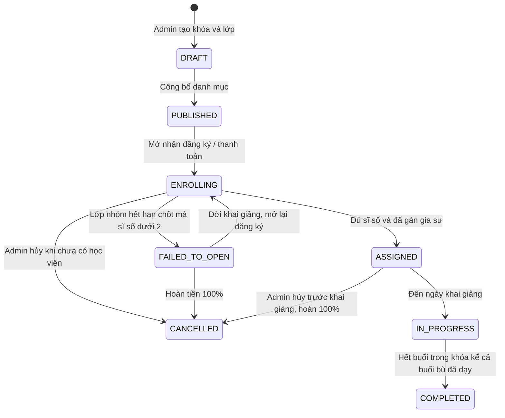

# Business Rule 04: Vòng đời lớp, điểm danh & Lộ trình Video Call

Tài liệu này chốt **trạng thái lớp/buổi**, **cách điểm danh**, và tách rõ phần **MVP** với phần **nâng cao**. Không có thuật toán ghép gia sư–học viên: việc “matching” chính là **Admin phân công** (BR-03).

---

## 1. Vòng đời lớp học (BR-04)

| Trạng thái | Ý nghĩa | Đăng ký mới |
| :--- | :--- | :---: |
| `DRAFT` | Admin đang soạn, học viên không thấy. | Không |
| `PUBLISHED` | Hiện trên danh mục, chưa nhận tiền. | Chưa |
| `ENROLLING` | Nhận đăng ký đến khi full hoặc hết hạn chốt. | Có, nếu còn chỗ |
| `ASSIGNED` | Đã có gia sư, chờ khai giảng. | Không (nhóm đã chốt; 1-1 đã đủ 1) |
| `IN_PROGRESS` | Đang học. | Không |
| `COMPLETED` | Kết thúc khóa. | Không |
| `FAILED_TO_OPEN` | Nhóm không đủ 2 học viên. Chờ Admin quyết. | Không |
| `CANCELLED` | Hủy hẳn. | Không |

**BR-04.01** — `PUBLISHED` chỉ để xem. Bắt đầu thu tiền khi Admin chuyển `ENROLLING` (có thể làm cùng lúc công bố nếu Admin chọn “mở đăng ký ngay”).

**BR-04.02** — Sau `ASSIGNED`, **đóng** đăng ký. Không nhận học viên giữa khóa.

**BR-04.03** — Điều kiện vào `ASSIGNED`:

- `ONE_ON_ONE`: 1 enrollment thành công + phân công gia sư hợp lệ.
- `GROUP`: hạn chốt đã tới, \(2 \le\) sĩ số \(\le 8\), phân công gia sư hợp lệ.

---

## 2. Vòng đời một buổi học

| Trạng thái buổi | Khi nào |
| :--- | :--- |
| `SCHEDULED` | Sinh từ mẫu lịch, chưa học. |
| `PENDING_RESCHEDULE` | Có xin nghỉ \(\ge 24\) giờ, chờ Admin. |
| `MAKEUP` | Buổi bù đã xếp. |
| `IN_SESSION` | Đang trong giờ học. |
| `COMPLETED` | Đã dạy xong, điểm danh đã chốt. |
| `ABSENCE_LATE` | Báo nghỉ muộn \(< 24\) giờ (ghi nhận, buổi có thể vẫn dạy). |
| `CANCELLED` | Không dạy, chờ/đã xử lý bù nếu cần. |

**BR-04.10** — Điểm danh chỉ nhập khi buổi `IN_SESSION` hoặc ngay sau khi kết thúc, trước khi `COMPLETED`.

---

## 3. Hình thức lớp: Online / Offline

**BR-04.20** — Mỗi lớp chọn đúng một hình thức khi tạo, không đổi sau khi có enrollment.

| Hình thức | Địa điểm | Cách điểm danh |
| :--- | :--- | :--- |
| `OFFLINE` | Tại Trung tâm. | Gia sư (hoặc Admin) check-in trên ứng dụng. Có thể dùng mã QR buổi học. |
| `ONLINE` | Phòng học ảo trong ứng dụng. | Tự động nếu thời gian có mặt \(\ge 70\%\) thời lượng buổi. Gia sư được sửa điểm danh trước khi chốt. |

**BR-04.21** — Không triển khai “dạy tại nhà học viên” trong MVP. Offline = tại Trung tâm.

**BR-04.22** — Học viên Online vắng (dưới 70% và gia sư không đánh có mặt) = `ABSENT`. Buổi nhóm vẫn `COMPLETED` nếu gia sư đã dạy.

---

## 4. Điểm danh — quy tắc chốt

| Mã | Quy tắc |
| :--- | :--- |
| **BR-04.30** | Mỗi cặp (học viên active, buổi) có một bản ghi: `PRESENT`, `ABSENT`, `LATE`, `EXCUSED`. |
| **BR-04.31** | `LATE`: có mặt nhưng vào sau **15 phút** so với giờ bắt đầu. Vẫn tính có tham gia buổi. |
| **BR-04.32** | `EXCUSED`: xin nghỉ \(\ge 24\) giờ đã được Admin ghi nhận. Lớp nhóm: buổi vẫn dạy. |
| **BR-04.33** | Hết **24 giờ** sau giờ kết thúc, hệ thống chốt điểm danh. Sau đó chỉ Admin được sửa. |
| **BR-04.34** | Buổi được tính **dạy hợp lệ** cho lương khi gia sư điểm danh (hoặc hệ thống Online ghi nhận gia sư \(\ge 70\%\)) và buổi chuyển `COMPLETED`. |

---

## 5. Lộ trình Video Call (không chặn nghiệp vụ MVP)

Tính năng phòng học trực tuyến **không** là điều kiện để các quy tắc BR-01 … BR-04.33 có hiệu lực. MVP Offline vẫn vận hành độc lập.

| Giai đoạn | Phạm vi | Ghi chú |
| :--- | :--- | :--- |
| **MVP** | Lớp Offline tại Trung tâm: lịch, đăng ký, phân công, điểm danh, lương. Lớp Online nếu làm: có thể dùng link phòng họp bên ngoài do Admin dán vào lớp; điểm danh do gia sư nhập tay. | Ưu tiên nghiệp vụ trung tâm. |
| **Giai đoạn 2** | Nhúng SDK (Agora / Jitsi / Zoom / Daily): audio/video, chia sẻ màn hình, chat, điểm danh tự động 70%. | Khi nghiệp vụ cốt lõi đã ổn. |
| **Giai đoạn 3** | Media server riêng (Mediasoup), bảng trắng, ghi hình lưu bài. | Nâng cao, ngoài phạm vi MVP. |

**BR-04.40** — Khi chưa có SDK: lớp `ONLINE` vẫn tạo được, nhưng buổi học dùng `meetingUrl` do Admin/gia sư cung cấp; không tự điểm danh theo 70%.
