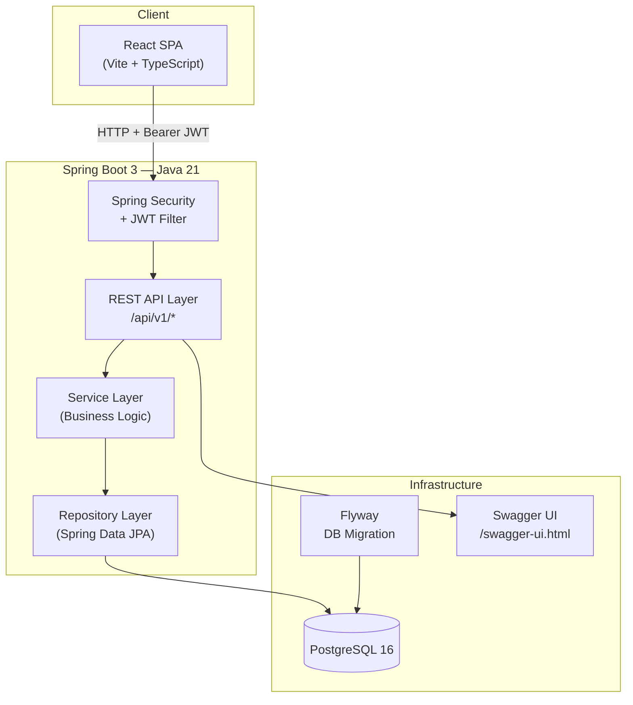
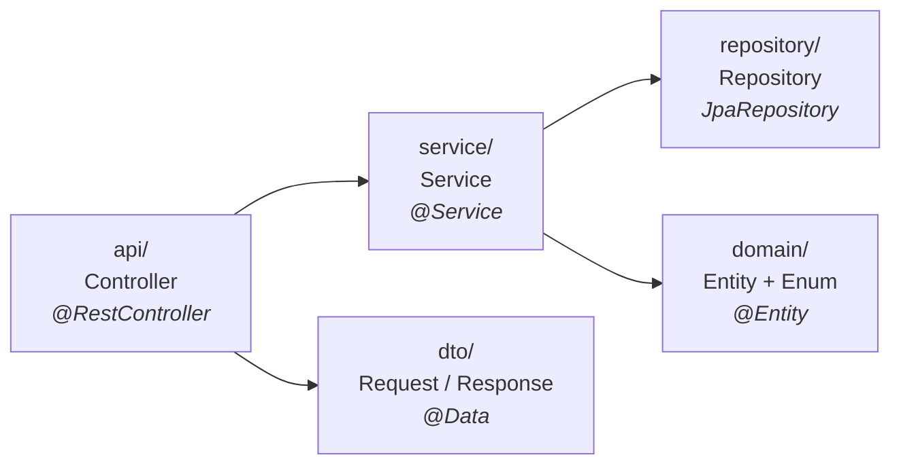
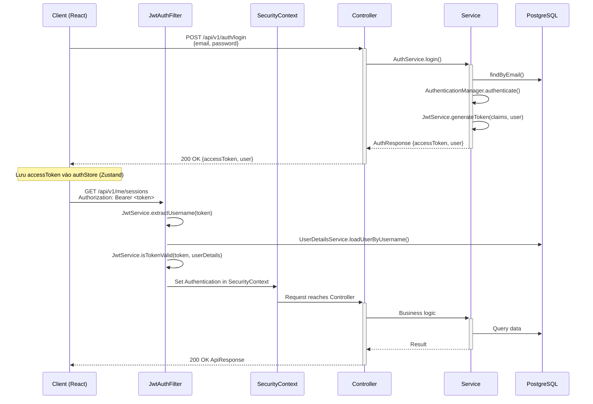
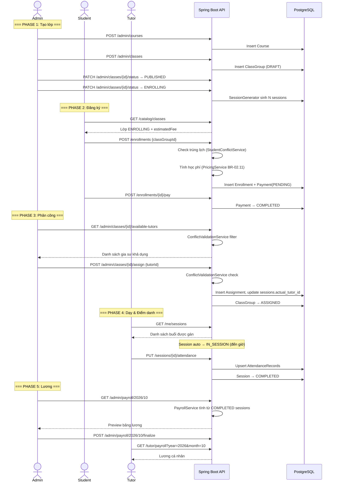
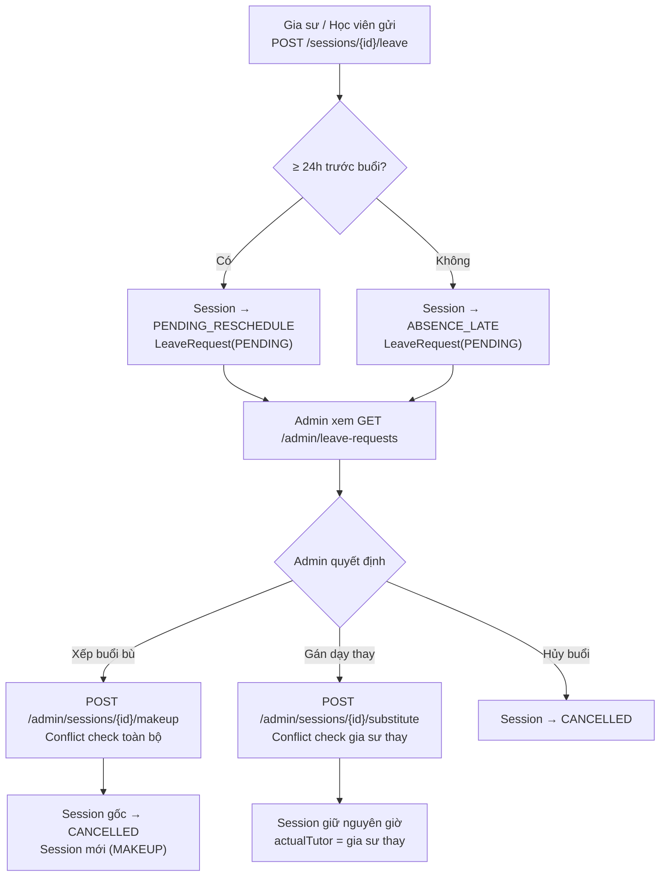
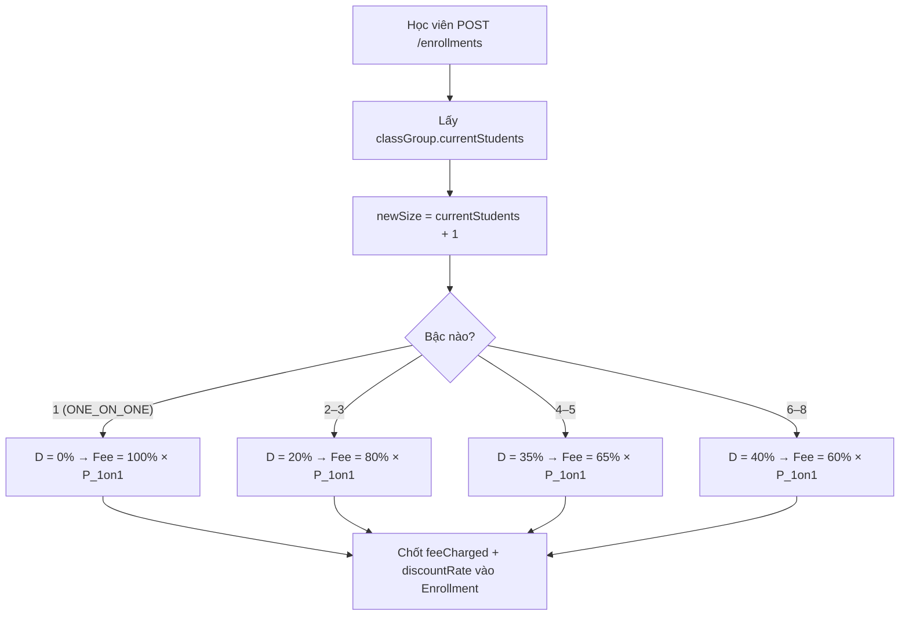

# Backend Architecture & API Specification — VietTriTutor

> **Phiên bản:** 1.0 · **Cập nhật:** 20/09/2026  
> Tài liệu mô tả kiến trúc back-end, luồng xử lý, lược đồ CSDL và đặc tả toàn bộ REST API cho hệ thống **VietTriTutor** — nền tảng quản lý trung tâm gia sư tập trung.  
> Bám sát các quy tắc nghiệp vụ trong `01-Business-Logic` (BR-01 → BR-04).

---

## Mục lục

1. [Tổng quan kiến trúc](#1-tổng-quan-kiến-trúc)
2. [Kiến trúc phân lớp (Layered Architecture)](#2-kiến-trúc-phân-lớp)
3. [Cấu trúc package Java](#3-cấu-trúc-package-java)
4. [Lược đồ CSDL (Database Schema / ERD)](#4-lược-đồ-csdl)
5. [Luồng xác thực & phân quyền (Security Flow)](#5-luồng-xác-thực--phân-quyền)
6. [Xử lý lỗi & Response Envelope](#6-xử-lý-lỗi--response-envelope)
7. [API Specification chi tiết](#7-api-specification-chi-tiết)
   - 7.1 Auth Module
   - 7.2 User Module
   - 7.3 Catalog Module (Course & ClassGroup)
   - 7.4 Enrollment Module
   - 7.5 Schedule Module (Session & LeaveRequest)
   - 7.6 Assignment Module
   - 7.7 Attendance Module
   - 7.8 Payroll Module
8. [Luồng xử lý nghiệp vụ trên Backend (Core Backend Flows)](#8-luồng-xử-lý-nghiệp-vụ-trên-backend)

---

## 1. Tổng quan kiến trúc



| Thành phần | Công nghệ | Phiên bản |
|:---|:---|:---:|
| Runtime | Java (OpenJDK / Temurin) | 21 |
| Framework | Spring Boot | 3.3.4 |
| Web | Spring Web (REST) | — |
| Security | Spring Security + JJWT | 0.12.6 |
| ORM | Spring Data JPA / Hibernate | — |
| Validation | Spring Boot Starter Validation (Jakarta) | — |
| Database | PostgreSQL | 16 |
| Migration | Flyway | — |
| API Docs | springdoc-openapi (Swagger UI) | 2.6.0 |
| Utilities | Lombok | — |
| Testing | Spring Boot Test, Spring Security Test, H2 | — |
| Build | Maven (mvnw) | — |

---

## 2. Kiến trúc phân lớp

Mỗi module nghiệp vụ đều tuân theo kiến trúc **4 lớp** dọc:



| Lớp | Trách nhiệm | Quy tắc |
|:---|:---|:---|
| **api (Controller)** | Nhận HTTP request, validate input (`@Valid`), gọi service, trả `ApiResponse<T>` | Không chứa logic nghiệp vụ. Dùng `@PreAuthorize` hoặc `hasRole()` cho phân quyền cấp method. |
| **dto** | Data Transfer Object — định hình request/response JSON | Không chứa annotation JPA. Dùng Lombok `@Data`, `@Builder`. Dùng Jakarta Validation (`@NotBlank`, `@Email`, `@Size`...). |
| **service** | Xử lý nghiệp vụ, enforce business rules (BR-01 → BR-04) | `@Transactional`. Throw `BusinessException(ErrorCode.*)` khi vi phạm. Không phụ thuộc `HttpServletRequest`. |
| **domain (Entity)** | JPA entity map tới bảng PostgreSQL | `@Entity`, `@Table`. Enum lưu `@Enumerated(EnumType.STRING)`. |
| **repository** | Truy vấn CSDL | Extends `JpaRepository<T, Long>`. Custom query dùng `@Query` JPQL hoặc native. |

### Cross-cutting concerns (package `common` & `config`)

| Package | Nội dung |
|:---|:---|
| `common.api` | `ApiResponse<T>` — wrapper JSON chuẩn cho mọi endpoint |
| `common.exception` | `BusinessException`, `ErrorCode` enum, `GlobalExceptionHandler` |
| `common.util` | `TimeOverlap` — utility kiểm tra giao nhau thời gian (BR-03.30) |
| `config` | `SecurityConfig`, `CorsConfig`, `OpenApiConfig` |
| `security.jwt` | `JwtService` (generate/validate token), `JwtAuthFilter` (OncePerRequestFilter) |
| `security` | `CurrentUser` — annotation/utility lấy user hiện tại từ SecurityContext |

---

## 3. Cấu trúc package Java

```text
com.viettritutor/
├── VietTriTutorApplication.java
│
├── common/
│   ├── api/
│   │   ├── ApiResponse.java              # Wrapper { success, data, message, errorCode }
│   │   └── PageResponse.java             # Wrapper phân trang { content[], page, size, totalElements, totalPages }
│   ├── exception/
│   │   ├── BusinessException.java        # RuntimeException + ErrorCode
│   │   ├── ErrorCode.java                # Enum: SCHEDULE_CONFLICT, CLASS_FULL, ...
│   │   └── GlobalExceptionHandler.java   # @RestControllerAdvice
│   └── util/
│       └── TimeOverlap.java              # static boolean isOverlapping(start1, end1, start2, end2)
│
├── config/
│   ├── SecurityConfig.java               # SecurityFilterChain, BCrypt, AuthManager
│   ├── CorsConfig.java                   # CORS cho frontend localhost:5173
│   └── OpenApiConfig.java                # Swagger metadata
│
├── security/
│   ├── jwt/
│   │   ├── JwtService.java               # generate, validate, extractClaims
│   │   └── JwtAuthFilter.java            # OncePerRequestFilter — parse Bearer token
│   └── CurrentUser.java                  # Lấy User từ SecurityContext
│
└── modules/
    ├── auth/                              # [DONE] Sprint 1
    │   ├── api/AuthController.java
    │   ├── dto/AuthRequest.java
    │   ├── dto/AuthResponse.java
    │   ├── dto/RegisterRequest.java
    │   └── service/AuthService.java
    │
    ├── user/                              # [DONE] Sprint 1
    │   ├── domain/User.java               # implements UserDetails
    │   ├── domain/TutorProfile.java       # (TODO) baseSalary, sessionRate, bio
    │   ├── domain/StudentProfile.java     # (TODO) phone, address
    │   ├── api/UserController.java        # (TODO) GET /me, Admin CRUD tutors
    │   ├── service/UserDetailsServiceImpl.java
    │   └── repository/UserRepository.java
    │
    ├── catalog/                           # (TODO) Sprint 2
    │   ├── domain/
    │   │   ├── Course.java
    │   │   ├── ClassGroup.java
    │   │   └── enums/
    │   │       ├── ClassType.java         # ONE_ON_ONE, GROUP
    │   │       ├── ClassStatus.java       # DRAFT → PUBLISHED → ENROLLING → ...
    │   │       ├── DeliveryMode.java      # ONLINE, OFFLINE
    │   │       ├── SchedulePattern.java   # MON_WED_FRI, TUE_THU_SAT, SAT_SUN
    │   │       └── TimeSlot.java          # SLOT_MORNING, SLOT_AFTERNOON, SLOT_EVENING_1, SLOT_EVENING_2
    │   ├── api/
    │   │   ├── AdminCourseController.java
    │   │   └── CatalogController.java
    │   ├── service/
    │   │   ├── CourseService.java
    │   │   ├── ClassGroupService.java
    │   │   └── PricingService.java        # Bảng chiết khấu BR-02
    │   ├── dto/
    │   └── repository/
    │
    ├── enrollment/                        # (TODO) Sprint 4
    │   ├── domain/
    │   │   ├── Enrollment.java
    │   │   └── Payment.java
    │   ├── api/EnrollmentController.java
    │   ├── service/
    │   │   ├── EnrollmentService.java
    │   │   └── StudentConflictService.java
    │   ├── dto/
    │   └── repository/
    │
    ├── schedule/                          # (TODO) Sprint 3
    │   ├── domain/
    │   │   ├── Session.java
    │   │   └── LeaveRequest.java
    │   ├── api/SessionController.java
    │   ├── service/
    │   │   ├── SessionGenerator.java      # Sinh buổi từ pattern
    │   │   └── RescheduleService.java
    │   ├── dto/
    │   └── repository/
    │
    ├── assignment/                        # (TODO) Sprint 5
    │   ├── domain/Assignment.java
    │   ├── api/AdminAssignmentController.java
    │   ├── service/
    │   │   ├── AssignmentService.java
    │   │   └── ConflictValidationService.java
    │   ├── dto/
    │   └── repository/
    │
    ├── attendance/                        # (TODO) Sprint 6
    │   ├── domain/AttendanceRecord.java
    │   ├── api/AttendanceController.java
    │   ├── service/AttendanceService.java
    │   ├── dto/
    │   └── repository/
    │
    └── payroll/                           # (TODO) Sprint 7
        ├── domain/
        │   ├── PayrollPeriod.java
        │   └── PayrollLine.java
        ├── api/PayrollController.java
        ├── service/PayrollService.java    # BR-02.40
        ├── dto/
        └── repository/
```

---

## 4. Lược đồ CSDL

### 4.1. Entity Relationship Diagram (ERD)

```mermaid
erDiagram
    users ||--o| tutor_profiles : "1:0..1"
    users ||--o| student_profiles : "1:0..1"
    courses ||--|{ class_groups : "1:N"
    class_groups ||--|{ sessions : "1:N"
    class_groups ||--|{ enrollments : "1:N"
    class_groups ||--o| assignments : "1:0..1"
    users ||--|{ assignments : "tutor 1:N"
    sessions ||--|{ attendance_records : "1:N"
    enrollments ||--|{ payments : "1:N"
    enrollments }|--|| users : "student N:1"
    sessions }o--o| users : "actual_tutor"
    sessions ||--o{ leave_requests : "1:N"
    users ||--|{ leave_requests : "requester 1:N"
    payroll_periods ||--|{ payroll_lines : "1:N"
    payroll_lines }|--|| users : "tutor N:1"

    users {
        bigserial id PK
        varchar email UK "NOT NULL"
        varchar password "NOT NULL"
        varchar full_name "NOT NULL"
        varchar role "CHECK (ROLE_ADMIN, ROLE_TUTOR, ROLE_STUDENT)"
        timestamp created_at "DEFAULT NOW()"
    }

    tutor_profiles {
        bigint id PK_FK "REFERENCES users(id)"
        numeric base_salary "NOT NULL DEFAULT 0"
        numeric session_rate "NOT NULL DEFAULT 0"
        text bio
    }

    student_profiles {
        bigint id PK_FK "REFERENCES users(id)"
        varchar phone
        text address
    }

    courses {
        bigserial id PK
        varchar name "NOT NULL"
        varchar subject "NOT NULL"
        varchar grade_level "NOT NULL (GRADE_1..GRADE_12)"
        numeric base_price_1on1 "NOT NULL — P_1on1"
        int total_sessions "NOT NULL — Tổng số buổi"
        int duration_minutes "NOT NULL DEFAULT 120"
        text description
        boolean active "DEFAULT true"
        timestamp created_at
        timestamp updated_at
    }

    class_groups {
        bigserial id PK
        bigint course_id FK "REFERENCES courses(id)"
        varchar class_code UK "VD: MATH-G10-MWF-M-001"
        varchar class_type "ONE_ON_ONE | GROUP"
        varchar delivery_mode "ONLINE | OFFLINE"
        varchar schedule_pattern "MON_WED_FRI | TUE_THU_SAT | SAT_SUN"
        varchar time_slot "SLOT_MORNING | SLOT_AFTERNOON | SLOT_EVENING_1 | SLOT_EVENING_2"
        varchar status "DRAFT | PUBLISHED | ENROLLING | ASSIGNED | IN_PROGRESS | COMPLETED | FAILED_TO_OPEN | CANCELLED"
        date start_date "Ngày khai giảng"
        date enrollment_deadline "Hạn chốt (nhóm)"
        int max_students "1 (1on1) hoặc 8 (group)"
        int current_students "DEFAULT 0"
        varchar meeting_url "Nullable — cho lớp ONLINE"
        timestamp created_at
        timestamp updated_at
    }

    sessions {
        bigserial id PK
        bigint class_group_id FK
        bigint actual_tutor_id FK "Nullable — gia sư dạy buổi đó"
        date session_date "NOT NULL"
        time start_time "NOT NULL"
        time end_time "NOT NULL"
        int session_number "Số thứ tự buổi"
        varchar status "SCHEDULED | PENDING_RESCHEDULE | MAKEUP | IN_SESSION | COMPLETED | ABSENCE_LATE | CANCELLED"
        varchar meeting_url "Nullable — link phòng buổi cụ thể"
        timestamp created_at
    }

    enrollments {
        bigserial id PK
        bigint student_id FK "REFERENCES users(id)"
        bigint class_group_id FK
        numeric fee_charged "NOT NULL — Học phí chốt lúc đăng ký"
        numeric discount_rate "NOT NULL — VD: 0.20 = 20%"
        int enrollment_size_at_time "Sĩ số tại thời điểm đăng ký"
        varchar status "ACTIVE | CANCELLED | REFUNDED"
        timestamp enrolled_at "DEFAULT NOW()"
    }

    payments {
        bigserial id PK
        bigint enrollment_id FK
        numeric amount "NOT NULL"
        varchar method "BANK_TRANSFER | MOCK"
        varchar status "PENDING | COMPLETED | FAILED | REFUNDED"
        varchar transaction_ref "Mã giao dịch"
        timestamp paid_at
        timestamp created_at
    }

    assignments {
        bigserial id PK
        bigint class_group_id FK UK "Mỗi lớp 1 gia sư chính"
        bigint tutor_id FK "REFERENCES users(id)"
        timestamp assigned_at "DEFAULT NOW()"
        bigint assigned_by FK "Admin user id"
    }

    attendance_records {
        bigserial id PK
        bigint session_id FK
        bigint student_id FK
        varchar status "PRESENT | ABSENT | LATE | EXCUSED"
        varchar note
        timestamp recorded_at
        boolean locked "DEFAULT false"
    }

    leave_requests {
        bigserial id PK
        bigint session_id FK
        bigint requester_id FK "REFERENCES users(id)"
        varchar requester_role "TUTOR | STUDENT"
        varchar reason
        varchar status "PENDING | APPROVED | REJECTED"
        varchar resolution "MAKEUP | SUBSTITUTE | CANCELLED | NONE"
        timestamp requested_at
        timestamp resolved_at
        bigint resolved_by FK "Admin id"
    }

    payroll_periods {
        bigserial id PK
        int year "NOT NULL"
        int month "NOT NULL"
        varchar status "DRAFT | FINALIZED"
        timestamp finalized_at
        bigint finalized_by FK
    }

    payroll_lines {
        bigserial id PK
        bigint payroll_period_id FK
        bigint tutor_id FK
        numeric base_salary "Lương cứng HĐ"
        numeric session_rate "Đơn giá buổi"
        int valid_sessions "Số buổi dạy hợp lệ (COMPLETED)"
        numeric session_pay "= valid_sessions × session_rate"
        numeric total_pay "= base_salary + session_pay"
        varchar note
    }
```

### 4.2. Flyway Migration Files

| Version | File | Nội dung |
|:---:|:---|:---|
| V1 | `V1__init_users.sql` | ✅ **Đã có** — `users`, `tutor_profiles`, `student_profiles`, seed admin |
| V2 | `V2__courses_and_classes.sql` | `courses`, `class_groups` |
| V3 | `V3__enrollments_payments.sql` | `enrollments`, `payments` |
| V4 | `V4__sessions_assignments.sql` | `sessions`, `assignments`, `leave_requests` |
| V5 | `V5__attendance_payroll.sql` | `attendance_records`, `payroll_periods`, `payroll_lines` |

---

## 5. Luồng xác thực & phân quyền

### 5.1. JWT Authentication Flow



### 5.2. URL Authorization Matrix (SecurityConfig)

```text
SecurityFilterChain:
  /api/v1/auth/**              → permitAll()
  /swagger-ui/**, /api-docs/** → permitAll()
  /api/v1/admin/**             → hasRole('ADMIN')
  /api/v1/tutor/**             → hasRole('TUTOR')
  /api/v1/enrollments/**       → hasRole('STUDENT')
  GET /api/v1/catalog/**       → authenticated()
  anyRequest()                 → authenticated()
```

### 5.3. Ownership Check (Service Layer)

URL-based authorization chỉ là lớp đầu tiên. Service phải **kiểm tra ownership**:

| Nghiệp vụ | Kiểm tra |
|:---|:---|
| Gia sư điểm danh | `session.actualTutorId == currentUser.id` |
| Học viên xem enrollment | `enrollment.studentId == currentUser.id` |
| Gia sư xem lương | `payrollLine.tutorId == currentUser.id` |
| Gia sư xem lịch | Chỉ trả sessions thuộc assignment của gia sư đó |

---

## 6. Xử lý lỗi & Response Envelope

### 6.1. Standard Response Envelope

Mọi endpoint đều trả về `ApiResponse<T>`:

**Success:**
```json
{
  "success": true,
  "data": { ... }
}
```

**Error:**
```json
{
  "success": false,
  "message": "This tutor has an overlapping session in another class",
  "errorCode": "SCHEDULE_CONFLICT"
}
```

**Validation Error (400):**
```json
{
  "success": false,
  "message": "Validation failed",
  "errorCode": "VALIDATION_ERROR",
  "data": {
    "email": "must be a valid email",
    "password": "must be at least 6 characters"
  }
}
```

### 6.2. Error Code Registry

| Error Code | HTTP Status | Mô tả | BR |
|:---|:---:|:---|:---:|
| `INVALID_CREDENTIALS` | 401 | Sai email/password | — |
| `EMAIL_ALREADY_EXISTS` | 409 | Email đã tồn tại | — |
| `ACCESS_DENIED` | 403 | Không có quyền | BR-01.10 |
| `USER_NOT_FOUND` | 404 | User không tồn tại | — |
| `COURSE_NOT_FOUND` | 404 | Khóa học không tồn tại | — |
| `CLASS_NOT_FOUND` | 404 | Lớp không tồn tại | — |
| `SESSION_NOT_FOUND` | 404 | Buổi học không tồn tại | — |
| `ENROLLMENT_NOT_FOUND` | 404 | Enrollment không tồn tại | — |
| `SCHEDULE_CONFLICT` | 409 | Gia sư trùng lịch khi phân công | BR-03.30 |
| `STUDENT_SCHEDULE_CONFLICT` | 409 | Học viên trùng lịch khi đăng ký | BR-03.31 |
| `CLASS_FULL` | 409 | Lớp đầy sĩ số | BR-02.10 |
| `CLASS_NOT_ENROLLING` | 422 | Lớp không nhận đăng ký | BR-04.01 |
| `ENROLLMENT_ALREADY_EXISTS` | 409 | Đã đăng ký lớp này rồi | — |
| `REFUND_NOT_ALLOWED` | 422 | Không được hoàn tiền giai đoạn này | BR-02.32 |
| `ATTENDANCE_LOCKED` | 422 | Điểm danh đã khóa sau 24h | BR-04.33 |
| `SESSION_NOT_IN_PROGRESS` | 422 | Buổi chưa/hết IN_SESSION | BR-04.10 |
| `INVALID_STATUS_TRANSITION` | 422 | Chuyển trạng thái không hợp lệ | BR-04 |

---

## 7. API Specification chi tiết

> **Base URL:** `http://localhost:8080/api/v1`  
> **Content-Type:** `application/json`  
> **Auth Header:** `Authorization: Bearer <accessToken>` (trừ endpoint Public)

---

### 7.1. Auth Module

#### `POST /auth/login` — Đăng nhập

| | |
|:---|:---|
| **Role** | Public |
| **BR** | — |

**Request Body:**
```json
{
  "email": "student@gmail.com",
  "password": "Student@123"
}
```

**Response (200):**
```json
{
  "success": true,
  "data": {
    "accessToken": "eyJhbGciOiJIUzI1NiIsInR5cCI6IkpXVCJ9...",
    "user": {
      "id": 2,
      "email": "student@gmail.com",
      "fullName": "Nguyen Van A",
      "role": "ROLE_STUDENT"
    }
  }
}
```

**Error (401):**
```json
{
  "success": false,
  "message": "Invalid email or password",
  "errorCode": "INVALID_CREDENTIALS"
}
```

---

#### `POST /auth/register` — Đăng ký học viên

| | |
|:---|:---|
| **Role** | Public |
| **BR** | BR-01.04 — Tài khoản mới luôn là `ROLE_STUDENT` |

**Request Body:**
```json
{
  "email": "phuhuynha@gmail.com",
  "password": "Abc@1234",
  "fullName": "Trần Thị B"
}
```

**Validation Rules:**
| Field | Constraint |
|:---|:---|
| `email` | `@NotBlank`, `@Email` |
| `password` | `@NotBlank`, `@Size(min=6)` |
| `fullName` | `@NotBlank`, `@Size(min=2, max=100)` |

**Response (200):** Giống login — trả accessToken + user info.

**Error (409):** `EMAIL_ALREADY_EXISTS`

---

### 7.2. User Module

#### `GET /me` — Lấy thông tin user hiện tại

| | |
|:---|:---|
| **Role** | Authenticated (any role) |

**Response (200):**
```json
{
  "success": true,
  "data": {
    "id": 5,
    "email": "tutor.minh@viettritutor.local",
    "fullName": "Lê Văn Minh",
    "role": "ROLE_TUTOR",
    "createdAt": "2026-09-15T10:30:00",
    "profile": {
      "baseSalary": 5000000,
      "sessionRate": 200000,
      "bio": "Giáo viên Toán cấp 3, 5 năm kinh nghiệm"
    }
  }
}
```

---

#### `GET /admin/users` — Danh sách users (phân trang)

| | |
|:---|:---|
| **Role** | `ROLE_ADMIN` |

**Query Params:**
| Param | Type | Default | Mô tả |
|:---|:---|:---:|:---|
| `page` | int | 0 | Trang (0-indexed) |
| `size` | int | 20 | Số record/trang |
| `role` | string | — | Filter: `ROLE_ADMIN`, `ROLE_TUTOR`, `ROLE_STUDENT` |
| `search` | string | — | Tìm theo email hoặc fullName |

**Response (200):**
```json
{
  "success": true,
  "data": {
    "content": [
      {
        "id": 3,
        "email": "tutor.minh@viettritutor.local",
        "fullName": "Lê Văn Minh",
        "role": "ROLE_TUTOR",
        "createdAt": "2026-09-15T10:30:00"
      }
    ],
    "page": 0,
    "size": 20,
    "totalElements": 15,
    "totalPages": 1
  }
}
```

---

#### `POST /admin/users/tutors` — Admin tạo tài khoản gia sư

| | |
|:---|:---|
| **Role** | `ROLE_ADMIN` |
| **BR** | BR-01.01 — Gia sư thuộc Trung tâm, do Admin tạo |

**Request Body:**
```json
{
  "email": "tutor.an@viettritutor.local",
  "password": "Tutor@123",
  "fullName": "Nguyễn Văn An",
  "baseSalary": 5000000,
  "sessionRate": 200000,
  "bio": "Giáo viên Tiếng Anh, IELTS 8.0"
}
```

**Response (201):** User info + TutorProfile

---

#### `PUT /admin/users/{userId}/tutor-profile` — Cập nhật hồ sơ gia sư

| | |
|:---|:---|
| **Role** | `ROLE_ADMIN` |

**Request Body:**
```json
{
  "baseSalary": 6000000,
  "sessionRate": 250000,
  "bio": "Cập nhật: kinh nghiệm 6 năm"
}
```

---

#### `PUT /me` — User cập nhật thông tin cá nhân

| | |
|:---|:---|
| **Role** | Authenticated |

**Request Body:**
```json
{
  "fullName": "Trần Thị B (updated)",
  "phone": "0901234567",
  "address": "123 Nguyễn Huệ, Q.1, TP.HCM"
}
```

---

### 7.3. Catalog Module (Course & ClassGroup)

#### `POST /admin/courses` — Tạo khóa học

| | |
|:---|:---|
| **Role** | `ROLE_ADMIN` |
| **BR** | BR-02.03 — Admin cấu hình giá gốc 1-1 |

**Request Body:**
```json
{
  "name": "Toán lớp 10 — Chương trình nâng cao",
  "subject": "MATH",
  "gradeLevel": "GRADE_10",
  "basePrice1on1": 8000000,
  "totalSessions": 36,
  "durationMinutes": 120,
  "description": "Chương trình Toán nâng cao lớp 10, bám sát SGK mới"
}
```

**Response (201):**
```json
{
  "success": true,
  "data": {
    "id": 1,
    "name": "Toán lớp 10 — Chương trình nâng cao",
    "subject": "MATH",
    "gradeLevel": "GRADE_10",
    "basePrice1on1": 8000000,
    "totalSessions": 36,
    "durationMinutes": 120,
    "description": "...",
    "active": true,
    "createdAt": "2026-09-20T14:00:00"
  }
}
```

---

#### `GET /admin/courses` — Danh sách khóa học (Admin)

| | |
|:---|:---|
| **Role** | `ROLE_ADMIN` |

**Query Params:** `page`, `size`, `subject`, `gradeLevel`, `active`

---

#### `PUT /admin/courses/{courseId}` — Sửa khóa học

| | |
|:---|:---|
| **Role** | `ROLE_ADMIN` |

---

#### `PATCH /admin/courses/{courseId}/toggle` — Ẩn/hiện khóa học

| | |
|:---|:---|
| **Role** | `ROLE_ADMIN` |

---

#### `POST /admin/classes` — Tạo lớp học (ClassGroup)

| | |
|:---|:---|
| **Role** | `ROLE_ADMIN` |
| **BR** | BR-03.01, BR-03.03, BR-04.01 |

**Request Body:**
```json
{
  "courseId": 1,
  "classType": "GROUP",
  "deliveryMode": "OFFLINE",
  "schedulePattern": "MON_WED_FRI",
  "timeSlot": "SLOT_MORNING",
  "startDate": "2026-10-07",
  "enrollmentDeadline": "2026-10-04",
  "meetingUrl": null
}
```

**Xử lý bên trong:**
1. Validate `courseId` tồn tại
2. Set `maxStudents` = 1 nếu `ONE_ON_ONE`, 8 nếu `GROUP`
3. Set `status` = `DRAFT`
4. Generate `classCode` tự động: `{SUBJECT}-G{GRADE}-{PATTERN}-{SLOT}-{SEQUENCE}`
5. **Khi chuyển PUBLISHED → ENROLLING**: gọi `SessionGenerator` sinh danh sách `Session` (BR-03.03)

**Response (201):**
```json
{
  "success": true,
  "data": {
    "id": 1,
    "classCode": "MATH-G10-MWF-M-001",
    "courseId": 1,
    "courseName": "Toán lớp 10 — Chương trình nâng cao",
    "classType": "GROUP",
    "deliveryMode": "OFFLINE",
    "schedulePattern": "MON_WED_FRI",
    "timeSlot": "SLOT_MORNING",
    "startDate": "2026-10-07",
    "enrollmentDeadline": "2026-10-04",
    "status": "DRAFT",
    "maxStudents": 8,
    "currentStudents": 0,
    "meetingUrl": null,
    "createdAt": "2026-09-20T14:05:00"
  }
}
```

---

#### `PATCH /admin/classes/{classId}/status` — Chuyển trạng thái lớp

| | |
|:---|:---|
| **Role** | `ROLE_ADMIN` |
| **BR** | BR-04 — Vòng đời lớp |

**Request Body:**
```json
{
  "newStatus": "ENROLLING"
}
```

**Bảng chuyển trạng thái hợp lệ:**

| From | To | Điều kiện |
|:---|:---|:---|
| `DRAFT` | `PUBLISHED` | — |
| `PUBLISHED` | `ENROLLING` | Sessions đã được sinh |
| `ENROLLING` | `ASSIGNED` | Đủ sĩ số + đã phân công gia sư |
| `ENROLLING` | `FAILED_TO_OPEN` | Hết deadline, sĩ số < 2 (GROUP) |
| `ENROLLING` | `CANCELLED` | Sĩ số = 0 |
| `FAILED_TO_OPEN` | `ENROLLING` | Admin dời khai giảng |
| `FAILED_TO_OPEN` | `CANCELLED` | Admin hoàn 100% |
| `ASSIGNED` | `IN_PROGRESS` | Đến ngày khai giảng |
| `ASSIGNED` | `CANCELLED` | Admin hủy, hoàn 100% |
| `IN_PROGRESS` | `COMPLETED` | Hết buổi |

**Error (422):** `INVALID_STATUS_TRANSITION`

---

#### `GET /admin/classes` — Danh sách lớp (Admin)

| | |
|:---|:---|
| **Role** | `ROLE_ADMIN` |

**Query Params:** `page`, `size`, `courseId`, `status`, `classType`, `schedulePattern`

---

#### `GET /catalog/classes` — Danh sách lớp đang mở (Catalog)

| | |
|:---|:---|
| **Role** | Authenticated (all roles) |
| **BR** | BR-01.12, BR-03.10 — Chỉ hiển thị lớp `ENROLLING` còn chỗ |

**Query Params:** `page`, `size`, `subject`, `gradeLevel`, `deliveryMode`, `schedulePattern`, `timeSlot`

**Response (200):**
```json
{
  "success": true,
  "data": {
    "content": [
      {
        "id": 1,
        "classCode": "MATH-G10-MWF-M-001",
        "courseName": "Toán lớp 10 — Chương trình nâng cao",
        "subject": "MATH",
        "gradeLevel": "GRADE_10",
        "classType": "GROUP",
        "deliveryMode": "OFFLINE",
        "schedulePattern": "MON_WED_FRI",
        "timeSlot": "SLOT_MORNING",
        "timeSlotLabel": "08:00 – 10:00",
        "startDate": "2026-10-07",
        "totalSessions": 36,
        "basePrice1on1": 8000000,
        "estimatedFee": 5200000,
        "discountRate": 0.35,
        "currentStudents": 3,
        "maxStudents": 8,
        "spotsLeft": 5
      }
    ],
    "page": 0,
    "size": 20,
    "totalElements": 5,
    "totalPages": 1
  }
}
```

> **Ghi chú:** `estimatedFee` và `discountRate` tính theo bậc sĩ số **sau** khi học viên hiện tại đăng ký (BR-02.11).

---

#### `GET /catalog/classes/{classId}` — Chi tiết lớp + lịch buổi học

| | |
|:---|:---|
| **Role** | Authenticated |

**Response:** Class detail + danh sách sessions (schedule preview)

---

### 7.4. Enrollment Module

#### `POST /enrollments` — Đăng ký lớp (+ tạo thanh toán)

| | |
|:---|:---|
| **Role** | `ROLE_STUDENT` |
| **BR** | BR-02.01, BR-02.02, BR-02.04, BR-02.10, BR-02.11, BR-03.10, BR-03.31 |

**Request Body:**
```json
{
  "classGroupId": 1
}
```

**Service Logic (EnrollmentService):**
1. Check lớp đang `ENROLLING` → else `CLASS_NOT_ENROLLING`
2. Check chưa enrollment lớp này → else `ENROLLMENT_ALREADY_EXISTS`
3. Check còn chỗ trống → else `CLASS_FULL`
4. **StudentConflictService**: so lịch sessions lớp mới với mọi enrollment active → else `STUDENT_SCHEDULE_CONFLICT` (BR-03.31)
5. **PricingService**: tính `feeCharged` theo bậc chiết khấu (sĩ số + 1) (BR-02.11)
6. Tạo `Enrollment` (status=`ACTIVE`) + `Payment` (status=`PENDING`)
7. Tăng `currentStudents` + 1
8. Nếu `currentStudents == maxStudents` → chuyển lớp `FULL` (nằm trong ENROLLING nhưng không nhận thêm)
9. **ONE_ON_ONE**: auto chuyển sẵn sàng assign

**Response (201):**
```json
{
  "success": true,
  "data": {
    "enrollmentId": 10,
    "classGroupId": 1,
    "classCode": "MATH-G10-MWF-M-001",
    "feeCharged": 5200000,
    "discountRate": 0.35,
    "payment": {
      "paymentId": 10,
      "amount": 5200000,
      "method": "MOCK",
      "status": "PENDING"
    }
  }
}
```

---

#### `POST /enrollments/{enrollmentId}/pay` — Xác nhận thanh toán (Mock)

| | |
|:---|:---|
| **Role** | `ROLE_STUDENT` |
| **BR** | BR-02.02 — Chỉ khi payment completed mới có enrollment hợp lệ |

**Request Body:**
```json
{
  "method": "BANK_TRANSFER",
  "transactionRef": "VCB-20260920-001"
}
```

**Response (200):**
```json
{
  "success": true,
  "data": {
    "paymentId": 10,
    "status": "COMPLETED",
    "paidAt": "2026-09-20T14:15:00"
  }
}
```

---

#### `GET /enrollments/my` — Danh sách lớp đã đăng ký (Student)

| | |
|:---|:---|
| **Role** | `ROLE_STUDENT` |
| **BR** | BR-01.12 — Chỉ xem enrollment của mình |

---

#### `DELETE /enrollments/{enrollmentId}` — Hủy đăng ký

| | |
|:---|:---|
| **Role** | `ROLE_STUDENT` |
| **BR** | BR-02.31, BR-02.32 |

**Service Logic:**
1. Check ownership
2. Check class status:
   - Lớp chưa `ASSIGNED` & trước `enrollmentDeadline` → hoàn 100% (BR-02.31)
   - Lớp đã `ASSIGNED` / `IN_PROGRESS` → reject 0% (BR-02.32), trừ khi Admin duyệt
3. Cập nhật enrollment status → `CANCELLED` hoặc `REFUNDED`
4. Giảm `currentStudents` - 1

---

#### `POST /admin/enrollments/{enrollmentId}/refund` — Admin duyệt hoàn tiền

| | |
|:---|:---|
| **Role** | `ROLE_ADMIN` |
| **BR** | BR-02.30 |

**Request Body:**
```json
{
  "refundPercentage": 100,
  "reason": "Lớp FAILED_TO_OPEN, hoàn 100%"
}
```

---

### 7.5. Schedule Module (Session & LeaveRequest)

#### `GET /me/sessions` — Lịch buổi học của tôi

| | |
|:---|:---|
| **Role** | `ROLE_TUTOR`, `ROLE_STUDENT` |

**Query Params:**
| Param | Type | Mô tả |
|:---|:---|:---|
| `from` | date | Filter từ ngày |
| `to` | date | Filter đến ngày |
| `status` | string | Filter theo session status |
| `classGroupId` | long | Filter theo lớp |

**Response (200):**
```json
{
  "success": true,
  "data": [
    {
      "sessionId": 100,
      "classGroupId": 1,
      "classCode": "MATH-G10-MWF-M-001",
      "courseName": "Toán lớp 10",
      "sessionDate": "2026-10-07",
      "startTime": "08:00",
      "endTime": "10:00",
      "sessionNumber": 1,
      "status": "SCHEDULED",
      "deliveryMode": "OFFLINE",
      "meetingUrl": null,
      "tutorName": "Lê Văn Minh"
    }
  ]
}
```

---

#### `GET /admin/sessions` — Admin xem tất cả buổi học

| | |
|:---|:---|
| **Role** | `ROLE_ADMIN` |

**Query Params:** `from`, `to`, `classGroupId`, `tutorId`, `status`, `page`, `size`

---

#### `POST /sessions/{sessionId}/leave` — Xin nghỉ buổi

| | |
|:---|:---|
| **Role** | `ROLE_TUTOR`, `ROLE_STUDENT` |
| **BR** | BR-03.40, BR-03.41, BR-03.42 |

**Request Body:**
```json
{
  "reason": "Bị ốm, xin nghỉ buổi ngày 10/10"
}
```

**Service Logic:**
1. Check ownership (gia sư assigned, hoặc học viên enrolled)
2. Tính thời gian: ≥ 24h trước → session `PENDING_RESCHEDULE`; < 24h → `ABSENCE_LATE`
3. Tạo `LeaveRequest` (status=`PENDING`)

**Response (201):**
```json
{
  "success": true,
  "data": {
    "leaveRequestId": 5,
    "sessionId": 100,
    "status": "PENDING",
    "sessionNewStatus": "PENDING_RESCHEDULE",
    "isLateNotice": false
  }
}
```

---

#### `GET /admin/leave-requests` — Admin xem danh sách xin nghỉ

| | |
|:---|:---|
| **Role** | `ROLE_ADMIN` |

**Query Params:** `status` (PENDING / APPROVED / REJECTED), `page`, `size`

---

#### `POST /admin/sessions/{sessionId}/makeup` — Xếp buổi bù

| | |
|:---|:---|
| **Role** | `ROLE_ADMIN` |
| **BR** | BR-03.40 (5.2, 5.3) — Buổi bù |

**Request Body:**
```json
{
  "makeupDate": "2026-10-15",
  "startTime": "14:00",
  "endTime": "16:00"
}
```

**Service Logic:**
1. Check **tất cả** học viên active + gia sư → không trùng khung giờ mới (conflict check qua `TimeOverlap`)
2. Tạo session mới với status `MAKEUP`, link tới session gốc
3. Session gốc → `CANCELLED`
4. Resolve LeaveRequest → `APPROVED`, resolution = `MAKEUP`

---

#### `POST /admin/sessions/{sessionId}/substitute` — Gán gia sư dạy thay

| | |
|:---|:---|
| **Role** | `ROLE_ADMIN` |
| **BR** | BR-03.40 (5.2), BR-02.43, BR-02.44 |

**Request Body:**
```json
{
  "substituteTutorId": 7
}
```

**Service Logic:**
1. Chặn trùng lịch gia sư thay (ConflictValidationService)
2. Gán `session.actualTutorId = substituteTutorId` (buổi giữ nguyên thời gian)
3. Resolve LeaveRequest → `APPROVED`, resolution = `SUBSTITUTE`

---

### 7.6. Assignment Module

#### `POST /admin/classes/{classId}/assign` — Phân công gia sư vào lớp

| | |
|:---|:---|
| **Role** | `ROLE_ADMIN` |
| **BR** | BR-03.20, BR-03.21, BR-03.30 |

**Request Body:**
```json
{
  "tutorId": 5
}
```

**Service Logic (ConflictValidationService):**
1. Lấy mọi sessions của lớp (status != `CANCELLED`)
2. Lấy mọi sessions đã assigned của gia sư (từ tất cả lớp khác)
3. Với mỗi cặp session mới ↔ session cũ: gọi `TimeOverlap.isOverlapping()` (giao nhau ≥ 1 phút)
4. Nếu trùng → `SCHEDULE_CONFLICT` kèm thông tin chi tiết:
   ```
   Gia sư Lê Văn Minh đã có ca lớp MATH-G10-MWF-M-001 
   từ 08:00 đến 10:00 vào Thứ 2, 07/10/2026. 
   Vui lòng chọn gia sư khác.
   ```
5. Nếu không trùng → tạo `Assignment`, gán `actualTutorId` cho mọi session, chuyển lớp → `ASSIGNED`

**Response (201):**
```json
{
  "success": true,
  "data": {
    "assignmentId": 3,
    "classGroupId": 1,
    "classCode": "MATH-G10-MWF-M-001",
    "tutorId": 5,
    "tutorName": "Lê Văn Minh",
    "assignedAt": "2026-09-25T10:00:00"
  }
}
```

---

#### `PUT /admin/classes/{classId}/reassign` — Đổi gia sư chính

| | |
|:---|:---|
| **Role** | `ROLE_ADMIN` |
| **BR** | BR-03.20 |

**Request Body:**
```json
{
  "newTutorId": 8
}
```

---

#### `GET /admin/classes/{classId}/available-tutors` — Gợi ý gia sư khả dụng

| | |
|:---|:---|
| **Role** | `ROLE_ADMIN` |

**Response:** Danh sách gia sư KHÔNG trùng lịch với sessions của lớp, kèm lịch rảnh tham khảo.

---

#### `PUT /tutor/availability` — Gia sư cập nhật lịch rảnh

| | |
|:---|:---|
| **Role** | `ROLE_TUTOR` |
| **BR** | BR-03.21 — Lịch rảnh chỉ là gợi ý cho Admin |

**Request Body:**
```json
{
  "availability": [
    { "dayOfWeek": "MONDAY", "timeSlot": "SLOT_MORNING" },
    { "dayOfWeek": "MONDAY", "timeSlot": "SLOT_AFTERNOON" },
    { "dayOfWeek": "WEDNESDAY", "timeSlot": "SLOT_MORNING" },
    { "dayOfWeek": "FRIDAY", "timeSlot": "SLOT_MORNING" }
  ]
}
```

---

#### `GET /tutor/availability` — Xem lịch rảnh hiện tại

| | |
|:---|:---|
| **Role** | `ROLE_TUTOR` |

---

### 7.7. Attendance Module

#### `PUT /sessions/{sessionId}/attendance` — Điểm danh buổi học

| | |
|:---|:---|
| **Role** | `ROLE_TUTOR` (lớp được gán), `ROLE_ADMIN` |
| **BR** | BR-04.10, BR-04.30 → BR-04.34 |

**Request Body:**
```json
{
  "records": [
    { "studentId": 2, "status": "PRESENT", "note": null },
    { "studentId": 3, "status": "LATE", "note": "Vào lớp lúc 08:20" },
    { "studentId": 4, "status": "ABSENT", "note": null }
  ]
}
```

**Service Logic:**
1. Check session status = `IN_SESSION` hoặc vừa kết thúc (chưa quá 24h) → else `SESSION_NOT_IN_PROGRESS`
2. Check ownership: gia sư chỉ điểm danh lớp mình
3. Check chưa bị locked (24h sau giờ kết thúc) → else `ATTENDANCE_LOCKED`
4. Upsert `AttendanceRecord` cho mỗi học viên
5. Sau khi điểm danh xong → chuyển session → `COMPLETED`

**Response (200):**
```json
{
  "success": true,
  "data": {
    "sessionId": 100,
    "sessionStatus": "COMPLETED",
    "recordsUpdated": 3
  }
}
```

---

#### `GET /sessions/{sessionId}/attendance` — Xem điểm danh buổi

| | |
|:---|:---|
| **Role** | `ROLE_TUTOR` (lớp mình), `ROLE_ADMIN` |

**Response (200):**
```json
{
  "success": true,
  "data": {
    "sessionId": 100,
    "sessionDate": "2026-10-07",
    "locked": false,
    "records": [
      { "studentId": 2, "studentName": "Nguyen Van A", "status": "PRESENT", "note": null },
      { "studentId": 3, "studentName": "Tran Thi C", "status": "LATE", "note": "Vào lớp lúc 08:20" }
    ]
  }
}
```

---

#### `PATCH /admin/sessions/{sessionId}/attendance/lock` — Admin khóa/mở khóa điểm danh

| | |
|:---|:---|
| **Role** | `ROLE_ADMIN` |
| **BR** | BR-04.33 |

---

#### `PATCH /admin/sessions/{sessionId}/attendance/{recordId}` — Admin sửa điểm danh (sau khi locked)

| | |
|:---|:---|
| **Role** | `ROLE_ADMIN` |
| **BR** | BR-04.33 — Sau locked chỉ Admin sửa |

---

### 7.8. Payroll Module

#### `GET /admin/payroll/{year}/{month}` — Xem / Tính lương tháng (preview)

| | |
|:---|:---|
| **Role** | `ROLE_ADMIN` |
| **BR** | BR-02.40 → BR-02.46 |

**Service Logic (PayrollService):**
1. Lấy tất cả sessions `COMPLETED` trong tháng/năm
2. Với mỗi session: xác định `actualTutorId` (có thể là dạy thay)
3. Đếm `validSessions` cho từng gia sư
4. Tính:
   - `sessionPay = validSessions × sessionRate` (từ TutorProfile)
   - `totalPay = baseSalary + sessionPay`

**Response (200):**
```json
{
  "success": true,
  "data": {
    "year": 2026,
    "month": 10,
    "status": "DRAFT",
    "lines": [
      {
        "tutorId": 5,
        "tutorName": "Lê Văn Minh",
        "baseSalary": 5000000,
        "sessionRate": 200000,
        "validSessions": 24,
        "sessionPay": 4800000,
        "totalPay": 9800000,
        "note": null
      },
      {
        "tutorId": 7,
        "tutorName": "Phạm Thị Hoa",
        "baseSalary": 4000000,
        "sessionRate": 180000,
        "validSessions": 18,
        "sessionPay": 3240000,
        "totalPay": 7240000,
        "note": "Dạy thay 2 buổi lớp MATH-G10-MWF-M-001"
      }
    ],
    "totalPayroll": 17040000
  }
}
```

---

#### `POST /admin/payroll/{year}/{month}/finalize` — Chốt bảng lương

| | |
|:---|:---|
| **Role** | `ROLE_ADMIN` |
| **BR** | BR-02.46 |

**Service Logic:**
1. Check period chưa finalized
2. Lock period → `FINALIZED`
3. Ghi `finalizedAt`, `finalizedBy`

---

#### `GET /tutor/payroll` — Gia sư xem lương của mình

| | |
|:---|:---|
| **Role** | `ROLE_TUTOR` |
| **BR** | BR-01.11, BR-02.46 — Chỉ xem lương mình |

**Query Params:** `year`, `month`

**Response (200):**
```json
{
  "success": true,
  "data": {
    "year": 2026,
    "month": 10,
    "status": "FINALIZED",
    "baseSalary": 5000000,
    "sessionRate": 200000,
    "validSessions": 24,
    "sessionBreakdown": [
      { "classCode": "MATH-G10-MWF-M-001", "sessions": 12, "isSubstitute": false },
      { "classCode": "ENG-G11-TTS-A-002", "sessions": 12, "isSubstitute": false }
    ],
    "sessionPay": 4800000,
    "totalPay": 9800000
  }
}
```

---

## 8. Luồng xử lý nghiệp vụ trên Backend

### 8.1. Luồng tạo lớp → đăng ký → phân công → dạy → lương



### 8.2. Luồng xin nghỉ → xử lý



### 8.3. Luồng tính học phí (PricingService)



---

> **Tài liệu tham chiếu:**  
> - [01-User-Roles-and-Permissions.md](../01-Business-Logic/01-User-Roles-and-Permissions.md) — BR-01  
> - [02-Pricing-and-Subscription-Rules.md](../01-Business-Logic/02-Pricing-and-Subscription-Rules.md) — BR-02  
> - [03-Scheduling-and-Conflict-Validation.md](../01-Business-Logic/03-Scheduling-and-Conflict-Validation.md) — BR-03  
> - [04-Matching-and-Class-Management.md](../01-Business-Logic/04-Matching-and-Class-Management.md) — BR-04  
> - [01-Project-Structure-React-SpringBoot.md](01-Project-Structure-React-SpringBoot.md) — Cấu trúc tổng thể
